# OSMEA ®️

[](https://github.com/masterfabric-mobile/osmea/blob/dev/LICENSE)
[](https://github.com/masterfabric-mobile/osmea)
[](https://shopify.dev/docs/api)


<p>

 OSMEA is an open-source, extensible, and developer-friendly CLI tool for building high-quality, production-ready mobile e-commerce apps. It enables rapid creation, customisation, and deployment of cross-platform (iOS & Android) storefronts integrated with leading e-commerce platforms such as Shopify, WooCommerce, and BigCommerce. The project aims to empower businesses and developers to launch, scale, and easily manage mobile commerce solutions.

 ## 💭Why OSMEA?

- 🌐 **Platform Agnostic** - Connect seamlessly to Shopify, WooCommerce, or BigCommerce
- 🧩 **Modular Design** - Use only the components you need
- 🚀 **Production Ready** - Enterprise-grade architecture designed for scalability
- 🎨 **Customizable** - Easily brand and extend to match your requirements
 
</p>

  ```diff
  🛍️ Create Your Professional Shop App.
  + ✨ Committed to developer experience and clean architecture.
  + 📱 Cross-platform app development simplified.
  ! 🔌 Seamlessly connecting to Shopify, WooCommerce, and more.
  ! 🚀 From concept to app store in record time.
  @@ 📱 Enterprise-ready with security and scalability built-in. @@
```

```mermaid
mindmap
  root(("OSMEA"))
    Core_Architecture((Core Architecture))
      BaseViewModel
      BLoC_Pattern(BLoC Pattern)
      API_Abstractions(API Abstractions)
      Service_Registry(Service Registry)
      Error_Handling(Error Handling)
      Logger_System(Logger System)
    API_Implementation((API Implementation))
      Request_Handlers(Request Handlers)
      Freezed_Models(Freezed Models)
      API_Services((API Services))
        InventoryService
        CustomerService
        EventsService
        LocationService
      DI_with_GetIt(DI with GetIt)
    UI_Framework((UI Framework))
      Material_Design_3(Material Design 3)
      Responsive_Layouts(Responsive Layouts)
      Custom_Widgets(Custom Widgets)
      Theme_Engine(Theme Engine)
      Form_Management(Form Management)
    Development_Tools((Development Tools))
      Flutter_Dart_SDK(Flutter/Dart SDK)
      API_Explorer(API Explorer)
      Code_Generation(Code Generation)
      CI_CD_Pipelines(CI/CD Pipelines)
      Testing_Utilities(Testing Utilities)
      VSCode_Extensions(VSCode Extensions)
    Platform_Support((Platform Support))
      iOS(iOS)
      Android(Android)
      Web_Dashboard(Web Dashboard)
```




## 🛠️ Features


<details>
  <summary>🔌 Platform Integration</summary>

  - [ ] **Multi‑Platform Support**: Shopify, WooCommerce, BigCommerce  
  - [ ] **Unified API Layer**: Consistent interface across platforms  
  - [ ] **Authentication**: OAuth 2.0 and API key support  
  - [ ] **Webhook Management**: Event‑driven architecture  
  - [ ] **Rate Limiting**: Smart request throttling  

</details>

<details>
  <summary>📱 Mobile Experience</summary>

  - [ ] **Cross‑Platform**: iOS & Android from a single codebase  
  - [ ] **Material Design 3**: Modern UI components  
  - [ ] **Responsive Layouts**: Works on all screen sizes  
  - [ ] **Theme System**: Dynamic color and style customization  
  - [ ] **Offline Support**: Core functionality without internet  

</details>

<details>
  <summary>🛠️ Developer Tools</summary>

  - [ ] **CLI Toolkit**: Rapid scaffolding and generators  
  - [ ] **Live Reload**: Instant feedback during development  
  - [ ] **Asset Generation**: Auto‑create icons and splash screens  
  - [ ] **Testing Suite**: Unit, widget, and integration tests  
  - [ ] **CI/CD Templates**: GitHub Actions and fastlane setup  

</details>

<details>
  <summary>🛍️ E‑commerce Features</summary>

  - [ ] **Product Catalog**: Browsing, search, filtering  
  - [ ] **Cart & Checkout**: Streamlined purchase flow  
  - [ ] **Payment Integration**: Multiple gateway support  
  - [ ] **User Accounts**: Registration, profiles, wishlists  
  - [ ] **Order Management**: History, tracking, reordering  

</details>

<details>
  <summary>📊 Business Tools</summary>

  - [ ] **Admin Dashboard**: Order and customer management  
  - [ ] **Inventory Control**: SKU management, stock tracking  
  - [ ] **Analytics**: User behavior and sales tracking  
  - [ ] **Marketing Tools**: Promotions and discount codes  
  - [ ] **Push Notifications**: Targeted customer messaging  

</details>

<details>
  <summary>🔒 Enterprise Ready</summary>

  - [ ] **Authentication**: Secure token‑based auth  
  - [ ] **Data Privacy**: GDPR compliance tools  
  - [ ] **Scalability**: Optimized for large catalogs  
  - [ ] **Monitoring**: Error reporting and performance tracking  
  - [ ] **Internationalization**: Multi‑language and currency  

</details>

