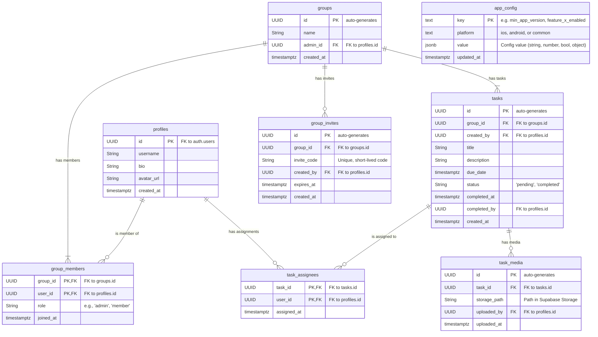

# DoneTogether: Database & Realtime Strategy

This document outlines the data structure, security policies, and realtime implementation for the DoneTogether application using Supabase.

**Implementation:** The schema, RLS, RPC functions, and storage structures are defined in the SQL migration and seed files under [supabase/](supabase/).

| Section | File |
|---------|----------------|
| Initial Setup (Tables, RLS, Functions) | [supabase/migrations/20260217012054_initial_setup.sql](supabase/migrations/20260217012054_initial_setup.sql) |
| Seed Data | [supabase/seed.sql](supabase/seed.sql) |

---

## 1. Database Schema (Postgres)

The schema is designed to be relational and normalized, with foreign keys enforcing data integrity. All tables are in the `public` schema.

**Key Indexes:**
- `group_members`: Composite primary key `(group_id, user_id)`. Index on `user_id` for quick lookups of a user's groups.
- `tasks`: Index on `group_id` and `status`. Index on `due_date`.
- `task_assignees`: Composite primary key `(task_id, user_id)`. Index on `user_id` for finding tasks assigned to a specific user.
- `group_invites`: Index on `invite_code`.
- `app_config`: Composite unique constraint on `(key, platform)` for fast lookup by key and platform.

### App Config Table (`app_config`)

Uygulama yapılandırması Supabase üzerinden yönetilir; platform bazlı (iOS / Android) veya ortak (`common`) değerler tutulabilir. Uygulama bu değerleri okuyarak davranışını (zorunlu güncelleme, özellik bayrakları, bakım modu vb.) günceller.

- **`key` (text, PK):** Config anahtarı (e.g. `min_app_version`, `feature_recurring_tasks_enabled`, `maintenance_mode`).
- **`platform` (text, part of unique):** `'common'`, `'ios'`, veya `'android'`. Aynı key için platform başına en fazla bir satır.
- **`value` (jsonb):** Değer (string, number, boolean veya basit object). Örnek: `"1.2.0"`, `true`, `{ "message": "Bakımdayız" }`.
- **`updated_at` (timestamptz):** Son güncelleme zamanı.

Client tarafında merge: Önce `common` satırları, sonra ilgili platform (`ios`/`android`) satırları uygulanır; platform değeri aynı key için `common`’ı override eder.

## 2. Row Level Security (RLS) Policy Strategy

RLS is critical for ensuring users can only access data they are authorized to see. The default policy should be to DENY all access, with specific `ENABLE ROW LEVEL SECURITY` policies created for each table.

- **`profiles` table:**
    - **READ:** Authenticated users can read any profile. (Or, for privacy, only profiles of users they share a group with).
    - **WRITE:** A user can only `UPDATE` their own profile (`id == auth.uid()`). `INSERT` is handled by a trigger on `auth.users`.

- **`groups` table:**
    - **READ:** A user can read a group's details if they are a member of that group (checked via `group_members` table).
    - **WRITE:**
        - `INSERT`: Any authenticated user can create a group.
        - `UPDATE`: Only a group member with the 'admin' role can update the group.

- **`group_members` table:**
    - **READ:** A user can see all members of a group they belong to.
    - **WRITE:**
        - `INSERT`: The group admin can add users. An Edge Function for invites will handle this.
        - `DELETE`: The group admin can remove a member (but not themselves if they are the last admin). A user can remove themselves.

- **`tasks` table:**
    - **READ:** A user can read tasks if they are a member of the task's group.
    - **WRITE:**
        - `INSERT`: Any member of a group can create a task in that group.
        - `UPDATE`: The task creator or a group admin can update a task. Any assignee can update the `status` to 'completed'.
        - `DELETE`: Only the task creator or a group admin can delete a task.

- **`app_config` table:**
    - **READ:** Anyone (including anon) can read. Uygulama giriş öncesi zorunlu güncelleme kontrolü yapabildiği için anon read kabul edilir.
    - **WRITE:** Sadece service role veya Supabase Dashboard üzerinden; client tarafından yazma yok. RLS ile `INSERT`/`UPDATE`/`DELETE` anon ve authenticated için kapalı tutulur.

## 3. Storage Strategy (Avatars & Task Media)

Supabase Storage is used for binary files. We will create two buckets:

- **`avatars` (public):**
    - **Access:** Publicly accessible for reading via a URL for simplicity and performance.
    - **Policies:**
        - `SELECT`: Anyone can view.
        - `INSERT/UPDATE/DELETE`: A user can only manage their own avatar file, enforced via a policy on the `storage.objects` table: `auth.uid() = owner`. The path would be something like `user-id-avatar.png`.

- **`task-media` (private):**
    - **Access:** All files are private. Access is granted via authenticated, RLS-policy-driven requests.
    - **Policies:**
        - `SELECT`: A user can read a media file if they are a member of the group that the corresponding task belongs to. This requires a `JOIN` in the policy definition.
        - `INSERT`: A user can upload media if they can create/update the associated task.
        - `DELETE`: A user can delete media if they can delete the associated task.

## 4. Realtime Strategy

Supabase Realtime is used to instantly reflect database changes in the UI.

- **Channels:** The Flutter app will subscribe to channels on a per-screen or per-feature basis to conserve resources.
    - **Group Channel:** When viewing a group's task list, subscribe to changes on the `tasks` table for that specific `group_id`.
        - `client.channel('public:tasks:group_id=eq.{current_group_id}')`
    - **User Notification Channel:** A user-specific channel for realtime invites or mentions.
        - `client.channel('user-notifications:{user_id}')` (This is a custom channel, not a direct table subscription). An Edge Function would broadcast to this channel.

- **UI Update Approach:**
    1. The Flutter app subscribes to a channel (e.g., tasks in a group).
    2. A change occurs in the database (e.g., another user creates a task).
    3. Supabase sends a JSON payload to the listening client.
    4. The Flutter state management solution (e.g., Riverpod, BLoC) intercepts this payload.
    5. It intelligently updates the state—either by inserting the new task into the list, updating an existing one, or removing one that was deleted.
    6. The UI, which is bound to the state, automatically rebuilds to show the change. This avoids a full screen refresh or manual refetching.

---
## Validation Checklist

### Database Schema
- [ ] Table `profiles` is created with the specified columns (see migration `20250615000000`).
- [ ] A trigger is set up to create a `public.profiles` row when a new `auth.users` entry is created.
- [ ] Table `groups` is created.
- [ ] Table `group_members` is created with a composite primary key.
- [ ] Table `tasks` is created.
- [ ] Table `task_assignees` is created with a composite primary key.
- [ ] Table `task_media` is created.
- [ ] Table `group_invites` is created.
- [ ] Table `app_config` is created with columns `key`, `platform`, `value` (jsonb), `updated_at` and unique constraint on `(key, platform)`.
- [ ] All specified Foreign Key constraints are in place.
- [ ] All recommended indexes are created on the database tables.

### Row Level Security (RLS)
- [ ] RLS is `ENABLED` on all user-data tables (`profiles`, `groups`, `group_members`, `tasks`, etc.).
- [ ] **`profiles` table policies:**
    - [ ] Users can read profiles (based on the chosen privacy level).
    - [ ] A user can only update their own profile.
- [ ] **`groups` table policies:**
    - [ ] A user can read a group's details only if they are a member.
    - [ ] Any authenticated user can create a group.
    - [ ] Only an 'admin' can update a group.
- [ ] **`group_members` table policies:**
    - [ ] A user can read the member list of a group they belong to.
    - [ ] Only an 'admin' can add/remove members (except for a user leaving).
    - [ ] A user can remove themselves from a group.
- [ ] **`tasks` table policies:**
    - [ ] A user can read tasks belonging to their groups.
    - [ ] Any group member can create a task.
    - [ ] An assignee can update the `status` to 'completed'.
    - [ ] Only the creator or an admin can fully update or delete a task.
- [ ] **`app_config` table policies:**
    - [ ] SELECT allowed for anon and authenticated (public read).
    - [ ] INSERT/UPDATE/DELETE not allowed for anon or authenticated (config only via Dashboard/service role).

### Storage
- [ ] A public bucket named `avatars` is created.
- [ ] Storage RLS policy for `avatars` allows users to manage only their own avatar.
- [ ] A private bucket named `task-media` is created.
- [ ] Storage RLS policy for `task-media` allows access only to members of the task's group.

### Realtime
- [ ] The Flutter app correctly subscribes to `tasks` table changes for a specific group.
- [ ] The UI updates in realtime when a new task is created.
- [ ] The UI updates in realtime when a task is marked as complete.
- [ ] The UI updates in realtime when a task is deleted.
- [ ] A user-specific channel is implemented for receiving invite notifications in realtime.
