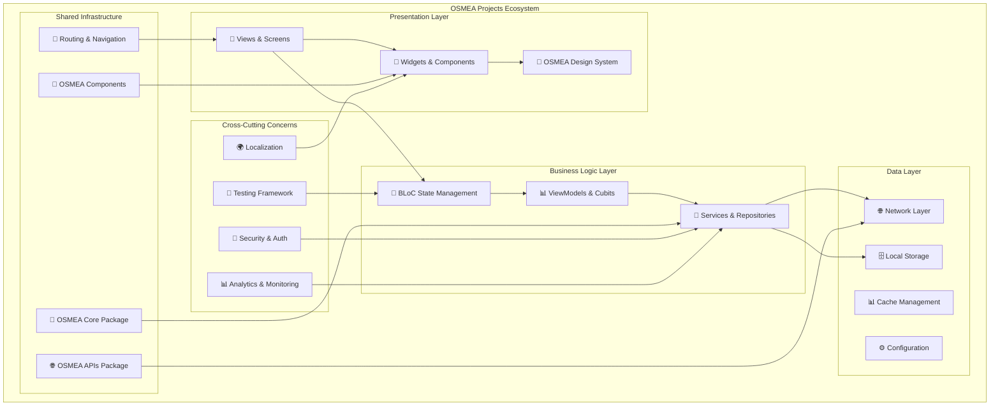
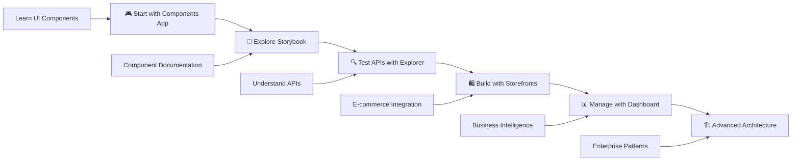

# OSMEA Projects 🚀

<div align="center">

[](https://github.com/masterfabric-mobile/osmea/tree/dev/projects)
[](https://flutter.dev)
[](https://dart.dev)
[](https://github.com/masterfabric-mobile/osmea)
[](../LICENSE)

</div>

<div align="center">

**"Complete Production-Ready Flutter Applications & Advanced Development Tools"**  
*7 enterprise-grade applications demonstrating the full power of OSMEA ecosystem*

[🚀 Live Demos](#-live-demos) • [📚 Main Documentation](../README.md) • [🐛 Report Issues](https://github.com/masterfabric-mobile/osmea/issues) • [💬 Discussions](https://github.com/masterfabric-mobile/osmea/discussions)

</div>

---

## 🌟 What is OSMEA Projects?

**OSMEA Projects** is a comprehensive collection of **7 production-ready Flutter applications** that showcase the enterprise-level capabilities of the OSMEA ecosystem. Each project represents a complete, fully-functional application designed to solve real-world business challenges while demonstrating best practices in Flutter development.

### 🎯 **Ecosystem Philosophy**

- 🏭 **Enterprise-Grade Architecture** - Every project follows clean architecture principles with scalable design patterns
- 🧩 **Modular Ecosystem** - Shared components, packages, and utilities across all projects
- 🔧 **Developer Experience First** - Comprehensive tooling, testing, and development utilities
- 📱 **Cross-Platform Excellence** - iOS, Android, Web, and Desktop support where applicable
- 🚀 **Production-Ready** - Real-world applications ready for deployment and scaling

### ⚡ **What Makes It Unique**

- **🏪 Complete E-commerce Stack** - Full WooCommerce and Supabase storefronts with admin tools
- **🔍 Advanced API Testing** - Sophisticated API explorer with 100+ endpoint support
- **🎨 Interactive Design System** - Living component library with real-time customization
- **📊 Business Intelligence** - Comprehensive admin dashboards with analytics
- **🛠️ Development Toolkit** - Complete set of tools for Flutter development workflow
- **🌍 Multi-Backend Support** - Integration examples for multiple backend systems

### 📊 **Ecosystem Statistics**

| Metric | Value | Description |
|--------|-------|-------------|
| **Projects** | 7 | Production-ready applications |
| **Codebase** | 99.4% Dart | Enterprise-level Flutter development |
| **API Coverage** | 100+ | Shopify + WooCommerce + Custom APIs |
| **Components** | 50+ | Reusable UI components |
| **Platforms** | 4+ | iOS, Android, Web, Desktop |
| **Architectures** | Multiple | Clean, BLoC, MVVM patterns |


---

## 🚀 Live Demos

<div align="center">

> **Experience OSMEA Projects in Action**  
> 🔍 **API Explorer** • 🎨 **Components App** • 📖 **Storybook** • 🛍️ **Storefronts**

*Interactive demos showcasing the full power of the OSMEA ecosystem*

| Project | Platform | Status | Live Demo |
|---------|----------|--------|-----------|
| 🔍 **API Explorer** | Web + macOS | ✅ Production | [Launch Explorer](#-api-explorer---the-ultimate-api-testing-platform) |
| 🎮 **Components App** | All Platforms | ✅ Production | [View Showcase](https://components.masterfabric.co) |
| 📖 **Storybook** | Web | ✅ Production | [Open Storybook](#-storybook---component-documentation-hub) |
| 🛍️ **Storefront Woo** | iOS + Android | ✅ Production | [Download App](#️-storefront-woocommerce---complete-e-commerce-app) |
| 🏪 **Storefront Supabase** | iOS + Android | 🔄 In Progress | [View Progress](#️-storefront-supabase---modern-backend-e-commerce) |
| 📊 **Admin Dashboard** | Web | ✅ Production | [Open Dashboard](#-admin-dashboard---e-commerce-management-platform) |

</div>

---

## 📋 Table of Contents

- [🌟 What is OSMEA Projects?](#-what-is-osmea-projects)
- [🚀 Live Demos](#-live-demos)
- [🎮 Complete Project Portfolio](#-complete-project-portfolio)
  - [🔍 API Explorer](#-api-explorer---the-ultimate-api-testing-platform)
  - [🛍️ Storefront WooCommerce](#️-storefront-woocommerce---complete-e-commerce-app)
  - [🏪 Storefront Supabase](#️-storefront-supabase---modern-backend-e-commerce)
  - [📊 Admin Dashboard](#-admin-dashboard---e-commerce-management-platform)
  - [🎮 Components App](#-components-app---interactive-ui-showcase)
  - [📖 Storybook](#-storybook---component-documentation-hub)
- [🏗️ OSMEA Projects Architecture Philosophy](#️-osmea-projects-architecture-philosophy)
- [🛠️ Development Workflow & Advanced Tooling](#️-development-workflow--advanced-tooling)
- [🎯 Use Cases & Target Audiences](#-use-cases--target-audiences)
- [🤝 Contributing](#-contributing)
- [📄 License](#-license)

---

## 🎮 Complete Project Portfolio

### 🔍 **API Explorer** - The Ultimate API Testing Platform

<div align="center">

[](https://flutter.dev)
[](./api_explorer)
[](./api_explorer/pubspec.yaml)
[](./api_explorer)

</div>

**The most comprehensive API testing and exploration tool for e-commerce platforms**

API Explorer is a **sophisticated, wizard-based API testing platform** designed specifically for e-commerce developers. With support for **110+ API endpoints** across Shopify and WooCommerce, it provides an enterprise-grade interface for API exploration, testing, and integration.

#### **🎯 Core Capabilities**
- 🧙‍♂️ **Intelligent Setup Wizard** - Guided configuration for Shopify and WooCommerce stores
- 🗄️ **SQLite Database Integration** - Persistent storage for configurations, history, and results
- 🔍 **110+ API Endpoints** - Complete coverage of Shopify REST, GraphQL, and WooCommerce APIs
- 📊 **Real-Time JSON Formatting** - Beautiful syntax highlighting with Flutter Highlight package
- 🔧 **Interactive Parameter Builder** - Dynamic form generation based on API requirements
- 📈 **Performance Monitoring** - Response time tracking and API health monitoring
- 💾 **Configuration Management** - SharedPreferences-based persistence for web platform

#### **🛒 E-commerce API Coverage**

| Platform | REST APIs | GraphQL | Auth Methods | Categories |
|----------|-----------|---------|--------------|------------|
| **Shopify** | 50+ endpoints | ✅ Full Support | OAuth 2.0, Private Apps, Access Tokens | 13+ categories |
| **WooCommerce** | 60+ endpoints | ❌ N/A | Consumer Key/Secret, JWT, OAuth 2.0 | 12+ categories |
| **Custom APIs** | ✅ Universal | ✅ Universal | API Keys, Bearer Tokens | Unlimited |

**API Categories**: Access Management, Billing, Customers, Discounts, Events, Inventory, Orders, Marketing, Gift Cards, Metafields, Products, Webhooks, Authentication, Cart Management, Checkout, and more.

#### **🏗️ Advanced Architecture**
- **Clean Architecture** - Layered design with clear separation of concerns (500+ handler files)
- **Dependency Injection** - Injectable pattern with GetIt service locator
- **Handler Pattern** - Each API endpoint has dedicated handler implementation
- **Service Registry** - Centralized API service management and discovery
- **State Persistence** - Session and configuration management with SharedPreferences
- **Error Handling** - Comprehensive error management with detailed error messages


**[📖 Complete Documentation](./api_explorer/README.md)** • **[🔗 GitHub](https://github.com/masterfabric-mobile/osmea/tree/dev/projects/api_explorer)**

---

### 🛍️ **Storefront WooCommerce** - Complete E-commerce App

<div align="center">

[](https://flutter.dev)
[](https://woocommerce.com)
[](https://bloclibrary.dev)
[](./storefront_woo)

</div>

**Enterprise-grade mobile e-commerce application with complete WooCommerce integration**

A **production-ready e-commerce mobile application** featuring advanced WordPress integration, multi-environment support, and enterprise-level architecture. Built with BLoC state management and comprehensive localization support powered by Slang.

#### **🎯 E-commerce Features**
- 🛒 **Complete Shopping Experience** - Product browsing, cart, checkout, and order management
- 👤 **Advanced User Management** - Registration, authentication, profiles, and order history
- 💳 **Payment Integration** - Multiple payment gateways with secure processing
- ❤️ **Wishlist & Favorites** - Advanced wishlist management with local persistence
- 🔍 **Advanced Search & Filtering** - Smart product search with multiple filter options
- 📱 **Responsive Design** - Optimized for all screen sizes and orientations
- 🌍 **Localization** - Multi-language support with Slang JSON-based translation system

#### **🌐 WordPress Integration**
- **Dynamic Configuration** - Real-time app configuration from WordPress REST API
- **Config Merging** - Intelligent merging of WordPress and local configurations
- **Fallback System** - Automatic fallback to local config on network failure
- **Retry Logic** - Smart retry system for configuration fetching
- **Remote Feature Toggles** - Enable/disable features remotely from WordPress admin
- **WordPress Config Service** - Dedicated service layer for WordPress API integration

#### **🏗️ Advanced Architecture**
- **BLoC Pattern** - Comprehensive state management with flutter_bloc 9.1.1
- **HydratedBloc** - Automatic state persistence to device storage
- **Multi-Environment** - Flavor-based development/production environments (Flavor 2.0.0)
- **Clean Architecture** - Layered design with dependency injection (Injectable 2.7.1)
- **Localization** - Slang 4.11.1-based i18n with build-time generation
- **Code Generation** - FlutterGen 5.10.0 for type-safe asset references


**[📖 Complete Documentation](./storefront_woo/README.md)** • **[🔗 GitHub](https://github.com/masterfabric-mobile/osmea/tree/dev/projects/storefront_woo)**

---

### 🏪 **Storefront Supabase** - Modern Backend E-commerce

<div align="center">

[](https://flutter.dev)
[](https://supabase.com)
[](https://bloclibrary.dev)
[](https://supabase.com)

</div>

**Next-generation e-commerce app powered by Supabase with real-time capabilities**

A **modern e-commerce application** showcasing Supabase integration with real-time features, advanced authentication, and PostgreSQL database management. Demonstrates modern backend-as-a-service patterns with Flutter.

#### **🎯 Supabase Features**
- ⚡ **Real-Time Updates** - Live product updates, cart synchronization, and order tracking
- 🔐 **Advanced Authentication** - Multi-provider auth with Row Level Security (RLS)
- 🗄️ **PostgreSQL Database** - Relational database with complex queries and joins
- 📁 **File Storage** - Product images and user uploads with CDN integration
- 🔔 **Push Notifications** - Real-time notifications for orders and updates
- 📊 **Analytics & Insights** - Built-in analytics with custom dashboards
- 🔄 **Database Migrations** - Version-controlled schema management


#### **🏗️ Architecture Highlights**
- **Repository Pattern** - Clean data layer abstraction
- **Real-Time State Management** - BLoC with Supabase streams
- **Offline-First** - Local storage with automatic synchronization
- **Multi-Environment** - Flavor-based environment management
- **Type Safety** - Generated Dart types from PostgreSQL schema
- **Clean Architecture** - SOLID principles with dependency injection

**[📖 Complete Documentation](./storefront_supabase/README.md)** • **[🔗 GitHub](https://github.com/masterfabric-mobile/osmea/tree/dev/projects/storefront_supabase)**

---

### 📊 **Admin Dashboard** - E-commerce Management Platform

<div align="center">

[](https://flutter.dev)
[](https://flutter.dev)
[](./admin_dashboard)
[](./admin_dashboard)

</div>

**Comprehensive e-commerce admin dashboard with advanced analytics and management tools**

A **sophisticated web-first admin platform** designed for e-commerce management with advanced analytics, product management, and business intelligence features. Built with modular architecture for maximum scalability.

#### **🎯 Management Features**
- 📦 **Product Management** - Advanced product CRUD with bulk operations and inventory tracking
- 📋 **Order Processing** - Order management with status tracking and fulfillment workflows
- 👥 **Customer Management** - Customer profiles, segmentation, and communication tools
- 📊 **Analytics Dashboard** - Sales analytics, performance metrics, and comprehensive reporting
- 💰 **Financial Reports** - Revenue tracking, profit analysis, and financial insights
- 🎯 **Marketing Tools** - Campaign management and customer engagement features
- 🔧 **Settings & Configuration** - System-wide settings and customization options

#### **🏗️ Modular Architecture**
- **Feature-Based Modules** - Independent feature modules for maintainability
- **Shared Services** - Common services across all modules (networking, storage, analytics)
- **Plugin Architecture** - Extensible plugin system for custom features
- **Multi-Environment** - Environment-specific configurations and deployments
- **Internationalization** - Multi-language support with Slang framework
- **Clean Architecture** - Layered design with clear boundaries and dependency rules


**[📖 Complete Documentation](./admin_dashboard/README.md)** • **[🔗 GitHub](https://github.com/masterfabric-mobile/osmea/tree/dev/projects/admin_dashboard)**

---

### 🎮 **Components App** - Interactive UI Showcase

<div align="center">

[](https://flutter.dev)
[](./components_app)
[](https://components.masterfabric.co)
[](./components_app)

</div>

**Interactive playground for exploring and customizing OSMEA UI components**

A **comprehensive showcase application** that demonstrates the full power of OSMEA Components library with live customization controls, real-time previews, and comprehensive documentation for each component.

#### **🎯 Showcase Features**
- 🎨 **Live Component Demos** - Interactive examples of all 50+ OSMEA components
- 🔧 **Real-Time Customization** - Live property controls and theme adjustments
- 📱 **Device Frame Previews** - Mobile, tablet, and desktop preview modes
- 🎭 **Theme Playground** - Dynamic theme generation and testing with color picker
- 📋 **Code Examples** - Copy-paste ready code snippets for each component
- 🔍 **Component Search** - Quick component discovery and navigation
- 📖 **Documentation** - Comprehensive usage guides and best practices

#### **🛠️ Developer Tools**
- **Property Inspector** - Live component property editing with real-time feedback
- **Color Picker Integration** - Advanced color selection and customization (flutter_colorpicker)
- **Responsive Testing** - Multi-screen size testing and preview
- **Device Frames** - Device frame package for realistic mobile/tablet previews
- **URL Launcher** - External documentation and example links

#### **🎨 Component Categories**
- **Form Components** - Inputs, selectors, date pickers, file uploads
- **Layout Components** - Grids, cards, containers, responsive layouts
- **Navigation** - Bottom navigation, app bars, drawers, tabs
- **Data Display** - Lists, tables, charts, badges, chips
- **Feedback** - Alerts, dialogs, toasts, progress indicators
- **Typography** - Text styles, headings, paragraphs with OSMEA extensions


**[🎮 Launch Showcase](https://components.masterfabric.co)** • **[📖 Complete Documentation](./components_app/README.md)** • **[🔗 GitHub](https://github.com/masterfabric-mobile/osmea/tree/dev/projects/components_app)**

---

### 📖 **Storybook** - Component Documentation Hub

<div align="center">

[](https://storybook.js.org/)
[](./storybook)
[](./storybook/pubspec.yaml)
[](./storybook)

</div>

**Comprehensive documentation and testing environment for OSMEA components**

A **Storybook-powered documentation platform** that provides isolated component development, testing, and documentation in a dedicated environment. Perfect for component developers and design system maintainers.

#### **🎯 Documentation Features**
- 📚 **Isolated Component Development** - Develop and test components in complete isolation
- 🧪 **Interactive Testing** - Test component variations, edge cases, and error states
- 📝 **Automated Documentation** - Generate documentation directly from component code
- 🎭 **Story-Based Organization** - Component stories with different use cases and scenarios
- 🔧 **Control Panels** - Interactive controls for component properties and state
- 📊 **Visual Testing** - Screenshot testing and visual regression detection
- 🌈 **Theme Testing** - Test components with different themes and color schemes

#### **🛠️ Developer Tools**
- **Story Templates** - Rapid story creation with predefined templates
- **Modular Structure** - Organized component stories by category
- **Device Frame Support** - Preview components in realistic device frames
- **Color Picker Integration** - Advanced color customization tools
- **Provider Support** - State management integration for complex components
- **Structure Validation** - Automated consistency checking across stories

#### **📚 Storybook Features**
- **Comprehensive Coverage** - Stories for all OSMEA Components
- **Usage Examples** - Real-world usage scenarios and best practices
- **Property Documentation** - Complete property documentation with types
- **Accessibility Testing** - Built-in accessibility checks and guidelines
- **Performance Metrics** - Component rendering performance analysis


**[📖 Complete Documentation](./storybook/README.md)** • **[🔗 GitHub](https://github.com/masterfabric-mobile/osmea/tree/dev/projects/storybook)**


---

## 🏗️ OSMEA Projects Architecture Philosophy

### 🎯 **Unified Architecture Principles**

All OSMEA projects follow a consistent architectural philosophy designed for **enterprise-scale applications**:



### 🧩 **Modular Design Principles**

#### **1. Package-First Architecture**
```dart
// Shared dependency structure across all projects
dependencies:
  osmea_core:
    path: ../../packages/core          # Shared utilities & business logic
  osmea_apis:
    path: ../../packages/apis          # Network layer & API management
  osmea_components:
    path: ../../packages/components    # UI component library
```

#### **2. Dependency Injection Patterns**
```dart
// Consistent DI setup across projects
@module
abstract class AppModule {
  @lazySingleton
  NetworkService get networkService;
  
  @lazySingleton
  ConfigService get configService;
  
  @singleton
  UserService get userService;
}
```

#### **3. State Management Strategy**

| Project | Pattern | Persistence | Use Case |
|---------|---------|-------------|----------|
| **API Explorer** | Cubit + Injectable | SharedPreferences | Configuration & History |
| **Storefront Apps** | BLoC + HydratedBloc | HydratedBloc | Shopping cart & User state |
| **Admin Dashboard** | BLoC + Repository | Local Storage | Business data & Analytics |
| **Components App** | Provider + Cubit | None | Demo state & Theming |
| **Storybook** | Provider | None | Story state & Controls |

### 🔧 **Development Standards**

#### **Code Generation Strategy**
```bash
# Consistent code generation across projects
flutter packages pub run build_runner build --delete-conflicting-outputs

# Project-specific generations
dart run injectable_generator              # Dependency injection
dart run slang_build_runner build         # Localization
dart run flutter_gen_runner               # Asset references
```

#### **Testing Pyramid**
```dart
// Comprehensive testing strategy
test/
├── unit/                    # Unit tests for business logic
├── widget/                  # Widget tests for UI components
├── integration/             # Integration tests for workflows
└── golden/                  # Golden tests for UI consistency
```

#### **Multi-Environment Support**
```yaml
# Flavor-based environment management
flavors:
  development:
    applicationIdSuffix: ".dev"
    versionNameSuffix: "-dev"
  staging:
    applicationIdSuffix: ".staging"
    versionNameSuffix: "-staging"
  production:
    # Production configuration
```

### 📊 **Cross-Project Architecture Comparison**

| Feature | API Explorer | Storefront Woo | Storefront Supabase | Admin Dashboard | Components App | Storybook |
|---------|-------------|----------------|---------------------|-----------------|----------------|-----------|
| **Clean Architecture** | ✅ Full | ✅ Full | ✅ Full | ✅ Full | ⚡ Simplified | ⚡ Simplified |
| **Dependency Injection** | Injectable + GetIt | Injectable + GetIt | Injectable + GetIt | Injectable + GetIt | Manual | Manual |
| **State Management** | Cubit | BLoC + Hydrated | BLoC + Real-time | BLoC + Repository | Provider | Provider |
| **Navigation** | GoRouter | GoRouter | GoRouter | GoRouter | GoRouter | Custom |
| **Localization** | None | Slang (Multi) | Slang (Multi) | Slang (Multi) | None | None |
| **Testing Coverage** | High | High | Medium | High | Medium | Low |

### 📱 **Platform-Specific Optimizations**

#### **Web Optimizations**
- **Code Splitting** - Route-based lazy loading
- **Tree Shaking** - Remove unused code
- **Web Renderers** - HTML vs CanvasKit selection
- **PWA Features** - Service workers, manifest, offline support

#### **Mobile Optimizations**
- **Split APKs** - Per-ABI builds for smaller downloads
- **ProGuard/R8** - Code obfuscation and shrinking
- **Image Optimization** - WebP format, caching strategies
- **Background Processing** - Isolates for heavy operations

#### **Desktop Optimizations**
- **Native Menus** - Platform-specific menu integration
- **File System Access** - Native file pickers
- **Window Management** - Multi-window support
- **System Tray** - Background operations

---

## 🛠️ Development Workflow & Advanced Tooling

### 🚀 **Quick Start Guide - Project Selection**

#### **Choose Your Development Path**

```bash
# Option 1: Complete ecosystem setup
git clone https://github.com/masterfabric-mobile/osmea.git
cd osmea
./setup.sh                    # Automated setup for all packages

# Option 2: Individual project setup
cd projects/[project-name]
flutter pub get
dart run build_runner build --delete-conflicting-outputs

# Option 3: Development-specific setup
cd projects/api_explorer
flutter pub get
dart run build_runner watch    # Watch mode for active development
```

#### **Project-Specific Quick Start Commands**

**🔍 API Explorer:**
```bash
cd projects/api_explorer
flutter pub get
dart run build_runner build --delete-conflicting-outputs
flutter run -d chrome                    # Web-optimized experience
# or
flutter run -d macos                     # macOS native app
```

**🛍️ Storefront WooCommerce:**
```bash
cd projects/storefront_woo
flutter pub get
dart run build_runner build --delete-conflicting-outputs
flutter run --flavor dev -t lib/main_dev.dart      # Development environment
flutter run --flavor prod -t lib/main_prod.dart    # Production environment
```

**🏪 Storefront Supabase:**
```bash
cd projects/storefront_supabase
flutter pub get
dart run build_runner build --delete-conflicting-outputs
flutter run                              # Real-time features ready
```

**📊 Admin Dashboard:**
```bash
cd projects/admin_dashboard
flutter pub get
dart run build_runner build --delete-conflicting-outputs
flutter run -d chrome --flavor dev       # Web-first experience
```

**🎮 Components App:**
```bash
cd projects/components_app
flutter pub get
flutter run -d chrome                    # Interactive showcase
```

**📖 Storybook:**
```bash
cd projects/storybook
flutter pub get
flutter run -d chrome                    # Component documentation
```

### 🧰 **Development Tools & Scripts**

#### **Automated Setup & Management**
```bash
# Root-level automation scripts
./setup.sh                              # Setup all packages and projects
./build_all.sh                          # Build all projects for all platforms
./test_all.sh                           # Run tests across all projects
./generate_all.sh                       # Run code generation for all projects
```

#### **Project Health Monitoring**
```bash
# Code quality and health checks
flutter analyze                         # Static analysis
flutter test --coverage                 # Test with coverage
dart run dependency_validator           # Dependency analysis
flutter pub deps --no-dev              # Dependency tree
```

#### **Performance Profiling**
```bash
# Performance monitoring across projects
flutter run --profile                   # Profile mode
flutter run --release --enable-software-rendering  # Performance testing
flutter drive --target=test_driver/perf_test.dart  # Performance tests
```

### 📊 **Project Comparison Matrix**

| Feature | API Explorer | Storefront Woo | Storefront Supabase | Admin Dashboard | Components App | Storybook |
|---------|-------------|----------------|---------------------|-----------------|----------------|-----------|
| **Primary Platform** | Web + macOS | iOS + Android | iOS + Android | Web | All Platforms | Web |
| **Backend Integration** | REST APIs | WooCommerce | Supabase | Multiple | None | None |
| **State Management** | Cubit + DI | BLoC + Hydrated | BLoC + Real-time | BLoC + Repository | Provider | Provider |
| **Authentication** | API Keys | JWT + OAuth | Supabase Auth | Multi-provider | None | None |
| **Offline Support** | Configuration | Cart + Products | Sync + Cache | Analytics Cache | None | None |
| **Real-time Features** | None | None | ✅ Full Support | Dashboard Updates | Live Theming | Live Preview |
| **Internationalization** | English | Multi-language | Multi-language | Multi-language | English | English |
| **Environment Support** | Single | Multi-flavor | Multi-flavor | Multi-environment | Single | Single |
| **Testing Coverage** | High | High | Medium | High | Medium | Low |
| **Production Ready** | ✅ Yes | ✅ Yes | 🔄 In Progress | ✅ Yes | ✅ Yes | ✅ Yes |

### 🔄 **CI/CD Pipeline Strategy**

#### **GitHub Actions Workflow**
```yaml
# .github/workflows/projects.yml
name: OSMEA Projects CI/CD
on: [push, pull_request]

jobs:
  test-all-projects:
    strategy:
      matrix:
        project: [api_explorer, storefront_woo, storefront_supabase, admin_dashboard, components_app, storybook]
    steps:
      - uses: actions/checkout@v3
      - uses: subosito/flutter-action@v2
        with:
          flutter-version: '3.19.0'
      - run: cd projects/${{ matrix.project }} && flutter pub get
      - run: cd projects/${{ matrix.project }} && flutter test
      - run: cd projects/${{ matrix.project }} && flutter build web --release
```

#### **Deployment Strategies**

| Project | Platform | Deployment Target | Strategy |
|---------|----------|-------------------|----------|
| **API Explorer** | Web + macOS | Vercel/Netlify + App Store | Static hosting + CI/CD |
| **Storefront Woo** | Mobile | App Stores | CI/CD + Fastlane |
| **Storefront Supabase** | Mobile | App Stores | CI/CD + Supabase CLI |
| **Admin Dashboard** | Web | Firebase Hosting | GitHub Actions |
| **Components App** | Web | GitHub Pages / Vercel | Static deployment |
| **Storybook** | Web | Netlify / Vercel | Static deployment |

### 📚 **Documentation & Learning Resources**

#### **Interactive Learning Path**


#### **Documentation Hierarchy**
- **📖 Project READMEs** - Individual project documentation with setup and usage
- **🏗️ Architecture Guides** - Cross-project patterns and design principles
- **🧪 Testing Strategies** - Testing approaches for each project type
- **🚀 Deployment Guides** - Platform-specific deployment instructions
- **💡 Best Practices** - Development standards and coding conventions
- **🎓 Tutorials** - Step-by-step guides for common tasks

#### **Code Examples & Snippets**
```dart
// Cross-project patterns

// 1. Dependency injection setup
@injectable
class ProjectService {
  Future<void> initialize() async {
    // Common initialization pattern
  }
}

// 2. Navigation setup
final router = GoRouter(
  routes: [
    // Declarative routing pattern
    GoRoute(
      path: '/home',
      builder: (context, state) => HomePage(),
    ),
  ],
);

// 3. State management pattern
class ProjectBloc extends Bloc<ProjectEvent, ProjectState> {
  ProjectBloc() : super(ProjectInitial()) {
    on<LoadDataEvent>(_onLoadData);
  }
  
  Future<void> _onLoadData(
    LoadDataEvent event,
    Emitter<ProjectState> emit,
  ) async {
    emit(ProjectLoading());
    try {
      final data = await repository.fetchData();
      emit(ProjectLoaded(data));
    } catch (e) {
      emit(ProjectError(e.toString()));
    }
  }
}
```

---

## 🎯 Use Cases & Target Audiences

### 👨‍💻 **For Flutter Developers**

#### **🌟 Learning & Skill Development**
- **🎓 Flutter Architecture Mastery** - Learn enterprise-level Flutter design patterns
- **🧩 Component Library Usage** - Master modern UI component libraries and design systems
- **🔧 State Management Patterns** - BLoC, Cubit, Provider, and Repository patterns
- **🌐 API Integration Techniques** - REST, GraphQL, and real-time API integration
- **🏗️ Clean Architecture Implementation** - Scalable app architecture with SOLID principles
- **🧪 Testing Strategies** - Unit, widget, integration, and golden testing approaches
- **📱 Cross-Platform Development** - iOS, Android, Web, and Desktop best practices

#### **⚡ Rapid Development**
- **🚀 Project Kickstarters** - Ready-to-use templates for new projects
- **📚 Code Reference Library** - Production-ready code examples and patterns
- **🎨 Design System Implementation** - Complete component library usage examples
- **🔌 Backend Integration Examples** - Multiple backend integration patterns (WooCommerce, Supabase)
- **📱 Cross-Platform Best Practices** - Platform-specific optimizations and configurations
- **🛠️ Development Tools** - Interactive tools for API testing and component exploration

### 🏢 **For Businesses & Enterprises**

#### **🛍️ E-commerce Solutions**
- **🏪 Complete Online Stores** - Ready-to-deploy mobile and web storefronts
- **📊 Admin Management Tools** - Comprehensive business management dashboards
- **🔍 API Integration Tools** - Custom API testing and integration platforms
- **📱 Multi-Platform Presence** - iOS, Android, and Web applications
- **🌍 Global Market Ready** - Internationalization and multi-currency support
- **💳 Payment Gateway Integration** - Multiple payment processor support

#### **💼 Enterprise Requirements**
- **🏗️ Scalable Architecture** - Handle enterprise-scale traffic and data volumes
- **🔐 Security Standards** - Enterprise-grade security implementation and best practices
- **📊 Business Intelligence** - Analytics, reporting, and dashboard capabilities
- **🔄 DevOps Integration** - CI/CD pipelines and automated deployment workflows
- **🧪 Quality Assurance** - Comprehensive testing and quality control processes
- **📈 Performance Monitoring** - Built-in performance tracking and optimization
- **🌍 Compliance** - GDPR, accessibility, and industry standards compliance

### 🎨 **For UI/UX Designers**

#### **🎭 Design System Exploration**
- **🎨 Interactive Component Library** - Live component customization and real-time testing
- **🌈 Theme Development** - Dynamic theme creation, validation, and export
- **📱 Responsive Design Testing** - Multi-device design validation and preview
- **🔍 Accessibility Testing** - WCAG compliance and screen reader testing tools
- **💡 Design Pattern Examples** - Modern mobile and web design pattern showcase
- **🎯 Consistency Validation** - Ensure design system consistency across platforms

#### **🚀 Rapid Prototyping**
- **⚡ Quick Mockups** - Rapid UI prototyping with real, functional components
- **🧪 Design Validation** - Test design concepts with functional interactive prototypes
- **📊 User Experience Testing** - Interactive UX flow validation and user testing
- **🎯 Design System Consistency** - Maintain consistency across all app screens
- **📱 Device Preview** - Real-time preview on multiple device sizes and orientations

### 🎓 **For Educational Institutions**

#### **📚 Computer Science Curriculum**
- **📱 Mobile Development Courses** - Complete Flutter development curriculum material
- **🏗️ Software Architecture Classes** - Real-world architecture examples and case studies
- **🌐 API Development & Integration** - Backend and API integration teaching resources
- **🧪 Software Testing Practices** - Comprehensive testing methodology and examples
- **💼 Industry Readiness** - Enterprise-level development practices and workflows
- **🎯 Capstone Projects** - Production-ready applications for student projects

#### **🔬 Research & Development**
- **📊 Performance Analysis** - Flutter performance optimization research opportunities
- **🧠 State Management Research** - Comparative analysis of state management patterns
- **🌍 Cross-Platform Development** - Multi-platform development strategy research
- **🔐 Security Implementation** - Mobile and web security best practices research
- **♿ Accessibility Studies** - Accessibility implementation and compliance research

### 🌟 **For Open Source Contributors**

#### **🤝 Contribution Opportunities**
- **🐛 Bug Fixes & Improvements** - Contribute to production-ready open source projects
- **✨ Feature Development** - Add new features and capabilities to existing projects
- **📚 Documentation Enhancement** - Improve and expand project documentation
- **🌍 Localization Contributions** - Add new language support and translations
- **🧪 Testing Improvements** - Enhance test coverage and quality assurance
- **🎨 UI/UX Enhancements** - Improve user interfaces and user experience

#### **💡 Innovation & Experimentation**
- **🚀 New Project Ideas** - Propose and develop new applications in the ecosystem
- **🔧 Tool Development** - Create new development tools and utilities
- **🎨 Component Development** - Add new UI components to the library
- **📊 Analytics & Monitoring** - Develop new monitoring and analytics features
- **🏗️ Architecture Patterns** - Implement and document new architectural patterns

### 🛠️ **For API Developers & Integrators**

#### **🔍 API Testing & Exploration**
- **🧪 Comprehensive API Testing** - Test Shopify, WooCommerce, and custom APIs
- **📊 API Performance Monitoring** - Monitor API response times and reliability
- **🔧 Integration Development** - Develop and test new API integrations
- **📚 API Documentation** - Interactive API documentation and usage examples
- **🔐 Authentication Testing** - Test various authentication methods (OAuth, JWT, API Keys)
- **🌐 Multi-Platform Testing** - Test APIs across web, mobile, and desktop platforms

#### **🌐 Backend Integration**
- **🛒 E-commerce API Integration** - Complete e-commerce backend integration examples
- **📊 Real-time Data Management** - Real-time API and database integration patterns
- **🔄 Data Synchronization** - Multi-platform data sync implementation strategies
- **💾 Database Management** - Various database integration patterns (SQLite, Supabase, REST)

### 📈 **Business Value Proposition**

#### **💰 Cost Savings**
- **⏰ Reduced Development Time** - 70% faster development with ready-to-use components and patterns
- **👥 Lower Team Requirements** - Comprehensive examples and documentation reduce learning curve
- **🔧 Maintenance Efficiency** - Well-structured, documented code reduces maintenance costs
- **🚀 Faster Time-to-Market** - Production-ready applications accelerate deployment
- **📚 Training Reduction** - Built-in examples serve as training material for new developers

#### **📊 Quality Assurance**
- **✅ Production-Ready Code** - Enterprise-tested applications and components
- **🧪 Comprehensive Testing** - High test coverage and quality assurance processes
- **🏗️ Scalable Architecture** - Handle business growth and increased usage
- **🔐 Security Best Practices** - Enterprise-grade security implementation
- **📱 Cross-Platform Consistency** - Uniform experience across all platforms

#### **🎯 Competitive Advantage**
- **📱 Multi-Platform Reach** - Reach customers on iOS, Android, and Web simultaneously
- **🌍 Global Market Ready** - Internationalization and localization built-in
- **🔄 Rapid Innovation** - Quick feature development and deployment capabilities
- **📊 Data-Driven Decisions** - Built-in analytics and business intelligence tools
- **⚡ Performance Excellence** - Optimized applications for best user experience

---

## 🔗 Related Links

- **[📚 Main OSMEA Repository](../README.md)** - Core OSMEA documentation and ecosystem overview
- **[🧩 OSMEA Components](../packages/components/)** - Comprehensive UI component library
- **[🔌 OSMEA APIs](../packages/apis/)** - Network layer and API management package
- **[⚙️ OSMEA Core](../packages/core/)** - Shared utilities and business logic foundation
- **[📖 Documentation](../docs/)** - Complete documentation, guides, and checklists
- **[🌐 Official Website](https://osmea.dev)** - OSMEA ecosystem website (coming soon)

---

## 📄 License

> 🔐 **License:** GNU AGPL v3.0  
> 📜 This project collection is protected under the **GNU Affero General Public License v3.0**.

### **What This Means:**

- ✅ **Commercial Use** - Free to use for commercial projects
- ✅ **Modification** - Modify the code to fit your needs
- ✅ **Distribution** - Share and distribute the code
- ✅ **Patent Use** - Express grant of patent rights from contributors
- ❗ **Disclose Source** - Source code must be made available when distributing
- ❗ **License Notice** - Must include license and copyright notice
- ❗ **Network Use** - Network use is considered distribution
- ❗ **Same License** - Modifications must use the same license

📎 Full license details available in the [`LICENSE`](../LICENSE) file.

### **Commercial Licensing**

For commercial licensing options or if AGPL doesn't fit your use case:
- 📧 **Email**: licensing@masterfabric.co
- 🌐 **Website**: [masterfabric.co](https://masterfabric.co)

---

## 🤝 Contributing

We welcome contributions from the community! OSMEA Projects is part of the larger **OSMEA ecosystem**, and we're always looking for talented developers to help improve it.

### **Ways to Contribute**

- 🐛 **Bug Fixes** - Help improve stability and reliability across all projects
- ✨ **New Features** - Add exciting functionality to existing projects
- 🔌 **API Integrations** - Add support for new APIs and backend services
- 📚 **Documentation** - Improve guides, examples, and API documentation
- 🧪 **Testing** - Increase test coverage and quality assurance
- 🎨 **UI/UX** - Enhance user interfaces and user experience
- 🌍 **Localization** - Add support for new languages and regions
- ♿ **Accessibility** - Improve accessibility features and WCAG compliance

### **Development Workflow**

1. **Fork & Clone**
   ```bash
   git clone https://github.com/your-username/osmea.git
   cd osmea/projects
   ```

2. **Create Branch**
   ```bash
   git checkout -b feature/your-feature-name
   # or
   git checkout -b fix/bug-description
   ```

3. **Make Changes**
   - Follow existing code patterns and conventions
   - Add tests for new features
   - Update documentation
   - Follow commit message conventions

4. **Test Changes**
   ```bash
   flutter test
   flutter analyze
   dart run build_runner build --delete-conflicting-outputs
   flutter run -d chrome
   ```

5. **Commit & Push**
   ```bash
   git add .
   git commit -m "feat: add new feature description"
   git push origin feature/your-feature-name
   ```

6. **Submit Pull Request**
   - Use the PR template
   - Provide clear description of changes
   - Link related issues
   - Request reviews from maintainers

### **Commit Message Convention**

Follow [Conventional Commits](https://www.conventionalcommits.org/):

```bash
# Features
feat: add WooCommerce subscription support
feat(api-explorer): implement GraphQL query builder

# Bug fixes
fix: resolve cart persistence issue on Android
fix(storefront): handle null product images gracefully

# Documentation
docs: update API Explorer README with new examples
docs(contributing): add contribution guidelines

# Refactoring
refactor: simplify authentication flow
refactor(admin): reorganize dashboard widgets

# Testing
test: add unit tests for cart BLoC
test(integration): add e2e checkout flow test

# Chore
chore: update dependencies to latest versions
chore(ci): improve GitHub Actions workflow
```

### **Code Review Process**

- All PRs require at least one review from maintainers
- CI/CD checks must pass (tests, linting, builds)
- Code coverage should not decrease
- Follow Dart/Flutter style guidelines and best practices
- Update documentation for user-facing changes
- Add appropriate tests for new features

### **Development Setup**

For detailed development setup instructions, see the [Development Workflow](#️-development-workflow--advanced-tooling) section above.

### **Community Guidelines**

- **[Code of Conduct](../CODE_OF_CONDUCT.md)** - Community standards and expectations
- **[Contributing Guide](../CONTRIBUTING.md)** - Detailed contribution guidelines
- **[Security Policy](../SECURITY.md)** - Security vulnerability reporting process

---

## 📞 Support & Community

### **Get Help**

- 🐛 **Bug Reports**: [GitHub Issues](https://github.com/masterfabric-mobile/osmea/issues)
- 💬 **Discussions**: [GitHub Discussions](https://github.com/masterfabric-mobile/osmea/discussions)
- 📧 **Email Support**: support@masterfabric.co
- 📚 **Documentation**: [OSMEA Docs](../docs/)

### **Stay Connected**

- 🌐 **Website**: [masterfabric.co](https://masterfabric.co)
- 📱 **Twitter**: [@masterfabric](https://twitter.com/masterfabric) (coming soon)
- 💼 **LinkedIn**: [MasterFabric Mobile](https://linkedin.com/company/masterfabric) (coming soon)
- 📹 **YouTube**: [OSMEA Tutorials](https://youtube.com/@osmea) (coming soon)

### **Acknowledgments**

#### **Built With**
- **[Flutter](https://flutter.dev)** - Google's amazing UI toolkit
- **[Dart](https://dart.dev)** - Modern, powerful programming language
- **[Injectable](https://pub.dev/packages/injectable)** - Code generation for dependency injection
- **[GetIt](https://pub.dev/packages/get_it)** - Service locator pattern
- **[GoRouter](https://pub.dev/packages/go_router)** - Declarative routing solution
- **[BLoC](https://bloclibrary.dev)** - Predictable state management library

#### **Special Thanks**
- **OSMEA Community** - Contributors, users, and supporters
- **MasterFabric Team** - Core maintainers and developers
- **Flutter Team** - For the incredible framework
- **Open Source Community** - For endless inspiration and collaboration

---

<div align="center">

**Built with ❤️ by the OSMEA Team**

**Part of the [OSMEA Ecosystem](../README.md)** - *Open Source Mobile E-commerce Architecture*

© 2025 MasterFabric Mobile • Maintained by the OSMEA Engineering Team

---

[](https://github.com/masterfabric-mobile/osmea/stargazers)
[](https://github.com/masterfabric-mobile/osmea/network/members)
[](https://github.com/masterfabric-mobile)

[⬆ Back to Top](#osmea-projects-)

</div>
