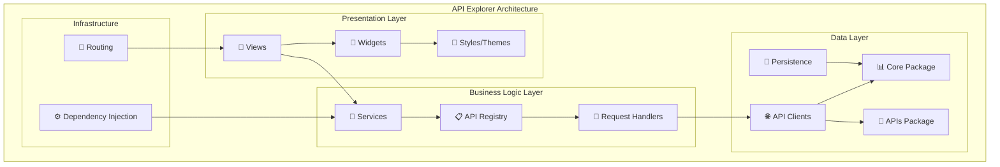

# 🔍 API Explorer

<p align="center">
  <a href="https://apps.apple.com/tr/app/mf-api-explorer/id6752110806?l=tr&mt=12"></a>
  &nbsp;

<div align="center">
  <a href="https://github.com/masterfabric-mobile/osmea"></a>
  <a href="pubspec.yaml"></a>
  <a href="https://flutter.dev"></a>
  <a href="https://dart.dev"></a>
  <a href="https://web.dev"></a>
</div>

<div style="margin-top: 1.5em; margin-bottom: 1.5em;"></div>

<br>

> **"The Ultimate Interactive API Testing & Exploration Tool"**

<div style="margin-bottom: 1.5em;"></div>

[Overview](#-overview) • [Features](#-features) • [Tech Stack](#️-technology-stack) • [Getting Started](#-getting-started) • [Documentation](#-documentation) • [Contributing](#-contributing) • [License](#-license)


<details>
<summary>🌟 Overview</summary>

## 🌟 What is API Explorer?

**API Explorer** is a **comprehensive, interactive web application** designed specifically for testing and exploring e-commerce APIs. Built with Flutter for web, it provides an enterprise-grade interface for developers to interact with Shopify and WooCommerce APIs through an intuitive wizard-based setup system.

### ⚡ **Key Highlights**

- 🧙‍♂️ **Wizard-Based Setup** - Interactive store configuration with guided flow
- 🔌 **Dual Platform Support** - Complete Shopify & WooCommerce integration (110+ endpoints)
- 📊 **Real-Time Testing** - Live API testing with formatted JSON responses
- 💾 **Persistent Storage** - SharedPreferences for configuration & history
- 🎨 **Modern UI** - Clean, responsive design with syntax highlighting
- 🔐 **Secure Authentication** - JWT tokens, OAuth 2.0, API keys support
- 📱 **Cross-Platform** - Web-first with macOS support
- 🏗️ **Clean Architecture** - Dependency injection with Injectable + GetIt
- 🎯 **Developer-Friendly** - 500+ API handlers with auto-generated forms

### 🎯 **Perfect For**

- **E-commerce Developers** - Test API integrations before implementation
- **API Integration Teams** - Explore available endpoints and parameters
- **QA Engineers** - Validate API responses and error handling
- **Product Managers** - Understand API capabilities and limitations
- **Students & Learners** - Hands-on API learning environment

### 📊 Project Statistics

<div align="center">

| Metric | Value | Metric | Value |
|--------|-------|--------|-------|
| 🔌 **Total Endpoints** | 110+ | 🛍️ **Shopify APIs** | 50+ |
| 🛒 **WooCommerce APIs** | 60+ | 📦 **API Handlers** | 500+ |
| 🎯 **Platforms** | Web, macOS | 🔧 **Handler Categories** | 30+ |
| 📚 **Dependencies** | 12 Core | 🏗️ **Architecture** | Clean + DI |

</div>

</details>

<details>
<summary>✨ Features</summary>

## 🛍️ Comprehensive API Support

API Explorer supports **110+ e-commerce API endpoints** across Shopify and WooCommerce platforms with dedicated handlers for each endpoint.

### 🏪 **Shopify APIs** (50+ Endpoints)

#### 🔐 **REST API Categories**

| Category | Endpoints | Key Features |
|----------|-----------|--------------|
| **Access Management** | 2 | Access Scope • Storefront Tokens |
| **Billing System** | 8 | Application Charges • Recurring Billing • Usage Charges • Credits |
| **Customer Management** | 8 | CRUD Operations • Address Management • Search • Count • Invites • Activation URLs |
| **Discounts & Promotions** | 12 | Discount Codes • Price Rules • Free Shipping • Free Items • Order Discounts |
| **Events & Analytics** | 3 | Event History • Count • Details |
| **Inventory Management** | 8 | Items • Levels • Locations • Stock Control • SKU Updates |
| **Order Processing** | 10 | Draft Orders • Abandoned Checkouts • Invoicing • Reopen • Complete |
| **Marketing Tools** | 6 | Marketing Events • Engagements • Campaigns • List • Create • Update |
| **Gift Cards** | 9 | Create • Disable • Update • Search • Custom Codes • Auto-generation |
| **Metafields** | 7 | CRUD Operations • Query Parameters • Multiple Resources |
| **Online Store** | 5 | Articles • Blogs • Themes • Metafield Management |
| **Products** | 8 | CRUD Operations • Tags • Variants • Collections • Smart Collections |
| **Webhooks** | 4 | CRUD Operations • Event Subscriptions • JSON/XML Format Support |

#### 🚀 **GraphQL API Categories**

| Category | Operations | Features |
|----------|------------|----------|
| **Products & Collections** | Queries • Mutations | Product Info • Collection Data • Product Updates • Collection Management |
| **Customers** | Queries • Mutations | Customer Retrieval • Create • Update • Disable • Count |
| **Webhooks** | Queries • Mutations | Webhook Info • Subscription Management • Create • Update • Delete |

### 🛒 **WooCommerce APIs** (60+ Endpoints)

#### 🔧 **Admin API Categories**

| Category | Count | Key Features |
|----------|-------|--------------|
| **Authentication** | 9 | Login • Signup • Logout • JWT Management • Password Reset • Delete Account • Auth Status |
| **Products** | 15+ | CRUD Operations • Categories • Tags • Reviews • Attributes • Terms • Brands • Variations |
| **Orders** | 8 | CRUD Operations • Status Updates • Refunds • Order Notes |
| **Customers** | 5 | CRUD Operations • Customer Management • Data Export |
| **Inventory & Catalog** | 12 | Coupons • Shipping Methods • Shipping Zones • Payment Gateways • Tax Classes |
| **Store Configuration** | 8 | Settings • System Status • Data Management • Currencies • Countries • Continents |
| **Analytics & Reports** | 6 | Sales Reports • Customer Reports • Product Reports • Top Sellers |
| **Webhooks** | 4 | CRUD Operations • Event Management • Subscriptions |

#### 🏪 **Store API Categories**

| Category | Count | Features |
|----------|-------|----------|
| **Cart Management** | 12+ | Cart Items (Add • Edit • Remove • List) • Cart Coupons • Token Management |
| **Checkout Process** | 5 | Checkout Data • Process Payment • Order Creation • Update Checkout |
| **Customer Features** | 7 | Wishlist (Create • Update • Delete • List Groups) • Add/Remove Items |
| **Product Browsing** | 10+ | Product Listings • Search • Categories • Tags • Attributes • Brands • Reviews |

### 🔗 **Authentication Methods**

**Shopify:**
- 🔑 Private Apps (API Key + Password)
- 🔐 Custom Apps (Access Token)
- 🎫 Storefront Access Tokens

**WooCommerce:**
- 🔑 Consumer Key/Secret
- 🎫 JWT Tokens
- 🔐 OAuth 2.0
- 🍪 Cookie-based Sessions

### ✨ Core Features

Wizard-based store setup, 110+ endpoint explorer, dynamic parameter forms, syntax-highlighted JSON responses, request history & persistence, secure token storage. Material Design 3, split view, response time tracking.

</details>


<details>
<summary>🛠️ Technology Stack</summary>

## 🛠️ Technology Stack

### **Frontend Framework**
- **Flutter 3.6+** - Cross-platform UI with web optimization
- **Dart 3.6+** - Type-safe, modern programming language
- **Material Design 3** - Modern, accessible design system
- **Responsive Design** - Mobile, tablet, desktop optimization

### **State Management & Architecture**
- **Dependency Injection** - Injectable ^2.5.1 + GetIt 7.7.0 for clean architecture
- **GoRouter ^15.1.1** - Declarative routing for SPA-like navigation
- **Clean Architecture** - Separation of concerns with handlers pattern
- **Service Locator Pattern** - Centralized dependency management

### **API Integration**
- **OSMEA APIs Package** - Internal API abstraction layer (../../packages/apis)
- **OSMEA Core Package** - Foundation utilities (../../packages/core)
- **HTTP Client** - Built-in Dio integration with interceptors
- **JSON Serialization** - Type-safe models with code generation

### **Development & Quality**
- **Build Runner 2.4.13** - Code generation for DI and models
- **Injectable Generator 2.6.2** - Automatic DI code generation
- **Flutter Lints ^5.0.0** - Strict linting for code quality
- **Flutter Highlight ^0.7.0** - Syntax highlighting for JSON responses
- **SharedPreferences ^2.5.3** - Persistent local storage
- **URL Launcher ^6.2.4** - External link handling

### **Platform Support**
- **Web (Primary)** - PWA-ready with modern web features
- **macOS Desktop** - Native desktop application support
- **Responsive Design** - Works seamlessly across all screen sizes

### 🏗️ Architecture Overview



### **Architecture Principles**

- **Clean Architecture** - Clear separation between layers
- **SOLID Principles** - Maintainable and extensible code
- **Handler Pattern** - Each API endpoint has dedicated handler
- **Service Registry** - Centralized API service management
- **Dependency Injection** - Loose coupling with Injectable
- **State Persistence** - Session and configuration management

### 📁 Project Structure

`lib/di/` (DI config), `lib/routes/` (GoRouter), `lib/services/` (handlers, registry, persistence). Handlers under `lib/services/handlers/shopify/` and `woocommerce/`. See repo for full tree.

</details>

<details>
<summary>🚀 Getting Started</summary>

## 🚀 Getting Started

### 📋 **Prerequisites**

```bash
# Required Software
Flutter SDK:  >=3.6.1
Dart SDK: >=3.6.1  
Git: Latest version
Code Editor: VS Code (recommended) or Android Studio

# Optional for macOS development
Xcode: Latest version (macOS users only)
```

### ⚡ **Quick Installation**

#### **Option 1: Clone Full OSMEA Ecosystem** (Recommended)

```bash
# Clone the main repository
git clone https://github.com/masterfabric-mobile/osmea.git
cd osmea

# Navigate to API Explorer
cd projects/api_explorer

# Install dependencies
flutter pub get

# Generate dependency injection code
dart run build_runner build --delete-conflicting-outputs

# Run on web
flutter run -d chrome

# Or run on macOS (if available)
flutter run -d macos
```

#### **Option 2: Standalone Setup**

```bash
# Clone repository
git clone https://github.com/masterfabric-mobile/osmea.git
cd osmea/projects/api_explorer

# Install dependencies (includes core packages)
flutter pub get

# Generate code
flutter packages pub run build_runner build

# Launch application
flutter run -d chrome
```

#### **Option 3: Development Mode**

```bash
# For active development with hot reload
flutter run -d chrome --hot

# Watch for code generation changes (in separate terminal)
dart run build_runner watch
```

### 🎮 **First-Time Setup Wizard**

1. **🚀 Launch Application**
   ```bash
   flutter run -d chrome
   ```
   - Application opens in browser (typically `localhost:port`)
   - You'll see the API Explorer home screen

2. **🧙‍♂️ Configure Your Store**
   - Click **"Setup Wizard"** or **"Add New Store"** button
   - Choose platform: **Shopify** or **WooCommerce**
   - Follow guided configuration steps

3. **🔐 Authentication Setup**
   - **For Shopify**: 
     - Enter store URL (e.g., `mystore.myshopify.com`)
     - Provide access token or app credentials
     - Select API version
   - **For WooCommerce**: 
     - Enter site URL (e.g., `https://mystore.com`)
     - Provide consumer key/secret or JWT token
     - Configure authentication method

4. **✅ Test Connection**
   - Wizard automatically validates credentials
   - Shows available API endpoints
   - Configuration saved for future use

### 🏗️ **Building for Production**

#### **Web Build**

```bash
# Build optimized web version (HTML renderer)
flutter build web --release --web-renderer html

# Build with CanvasKit renderer (better performance, larger bundle)
flutter build web --release --web-renderer canvaskit

# Output located in: build/web/
# Deploy build/web directory to your hosting service
# (Vercel, Netlify, Firebase Hosting, AWS S3, etc.)
```

#### **macOS Build**

```bash
# Build macOS application
flutter build macos --release

# Find built app in:
# build/macos/Build/Products/Release/api_explorer.app
```

### 👨‍💻 Development Guide

Add handlers in `lib/services/handlers/`, implement `ApiRequestHandler`, register in `ApiServiceRegistry`. Run `dart run build_runner build`. See repo for full guide.

### 🚀 Deployment

Web: `flutter build web --release`. Deploy `build/web/` to Vercel, Netlify, Firebase Hosting, or GitHub Pages. macOS: `flutter build macos --release`.

### 🔧 Troubleshooting

Clean: `flutter clean && dart run build_runner build --delete-conflicting-outputs`. Use HTML renderer if CanvasKit fails. Update deps: `flutter pub upgrade`.

</details>


<details>
<summary>📚 Documentation</summary>

- **Monorepo:** [github.com/masterfabric-mobile/osmea](https://github.com/masterfabric-mobile/osmea)
- **Docs:** [OSMEA Documentation](https://github.com/masterfabric-mobile/osmea/tree/dev/docs)
- **Report issues:** [GitHub Issues](https://github.com/masterfabric-mobile/osmea/issues)
- **Discussions:** [GitHub Discussions](https://github.com/masterfabric-mobile/osmea/discussions)
- **OSMEA Home:** [README](../../README.md)

</details>


<details>
<summary>🤝 Contributing</summary>

## 🤝 Contributing

We welcome contributions from the community! API Explorer is part of the **OSMEA ecosystem**, and we're always looking for talented developers to help improve it.

### **Ways to Contribute**

- 🐛 **Bug Fixes** - Help improve stability and reliability
- ✨ **New Features** - Add exciting functionality
- 🔌 **API Handlers** - Add support for new endpoints
- 📚 **Documentation** - Improve guides and examples
- 🧪 **Testing** - Increase test coverage
- 🎨 **UI/UX** - Enhance user interface and experience
- 🌍 **Localization** - Add language support
- ♿ **Accessibility** - Improve accessibility features

### **Development Workflow**

1. **Fork & Clone**
   ```bash
   git clone https://github.com/your-username/osmea.git
   cd osmea/projects/api_explorer
   ```

2. **Create Branch**
   ```bash
   git checkout -b feature/your-feature-name
   # or
   git checkout -b fix/bug-description
   ```

3. **Make Changes**
   - Follow existing code patterns
   - Add tests for new features
   - Update documentation
   - Follow commit message conventions

4. **Test Changes**
   ```bash
   flutter test
   flutter analyze
   dart run build_runner build --delete-conflicting-outputs
   flutter run -d chrome
   ```

5. **Commit & Push**
   ```bash
   git add .
   git commit -m "feat: add new API handler for Shopify products"
   git push origin feature/your-feature-name
   ```

6. **Submit Pull Request**
   - Use the PR template
   - Provide clear description
   - Link related issues
   - Request reviews

### **Commit Message Convention**

Follow [Conventional Commits](https://www.conventionalcommits.org/):

```bash
# Feature
feat: add WooCommerce product variations handler

# Bug fix
fix: resolve CORS issue with JWT authentication

# Documentation
docs: update API Explorer README with deployment guide

# Refactoring
refactor: simplify API handler registration logic

# Testing
test: add unit tests for Shopify webhook handlers

# Chore
chore: update dependencies to latest versions
```

### **Code Review Process**

- All PRs require at least one review
- CI/CD checks must pass
- Code coverage should not decrease
- Follow Dart/Flutter style guidelines
- Update documentation for user-facing changes

### **Development Setup**

For detailed development setup, see [Getting Started](#-getting-started) section.

### **Community Guidelines**

- **[Code of Conduct](../../CODE_OF_CONDUCT.md)** - Community standards
- **[Contributing Guide](../../CONTRIBUTING.md)** - Detailed guidelines
- **[Security Policy](../../SECURITY.md)** - Security reporting

---

[](https://github.com/masterfabric-mobile/osmea/stargazers)
[](https://github.com/masterfabric-mobile/osmea/network/members)
[](https://github.com/masterfabric-mobile)


</div>
</details>


<table>
  <tr>
    <td align="center"></td>
    <td align="center"></td>
    <td align="center"></td>
  </tr>
  <tr>
    <td align="center"></td>
    <td align="center"></td>
  </tr>
</table>

## 📄 License

This project is licensed under **GNU AGPL v3.0**. See the root `LICENSE` file in the repository.


