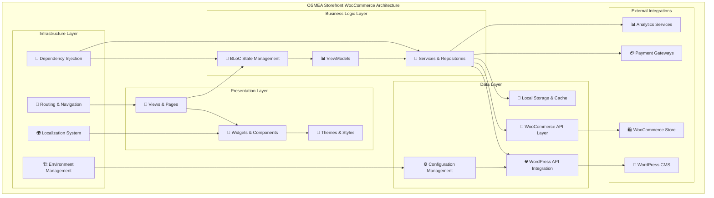
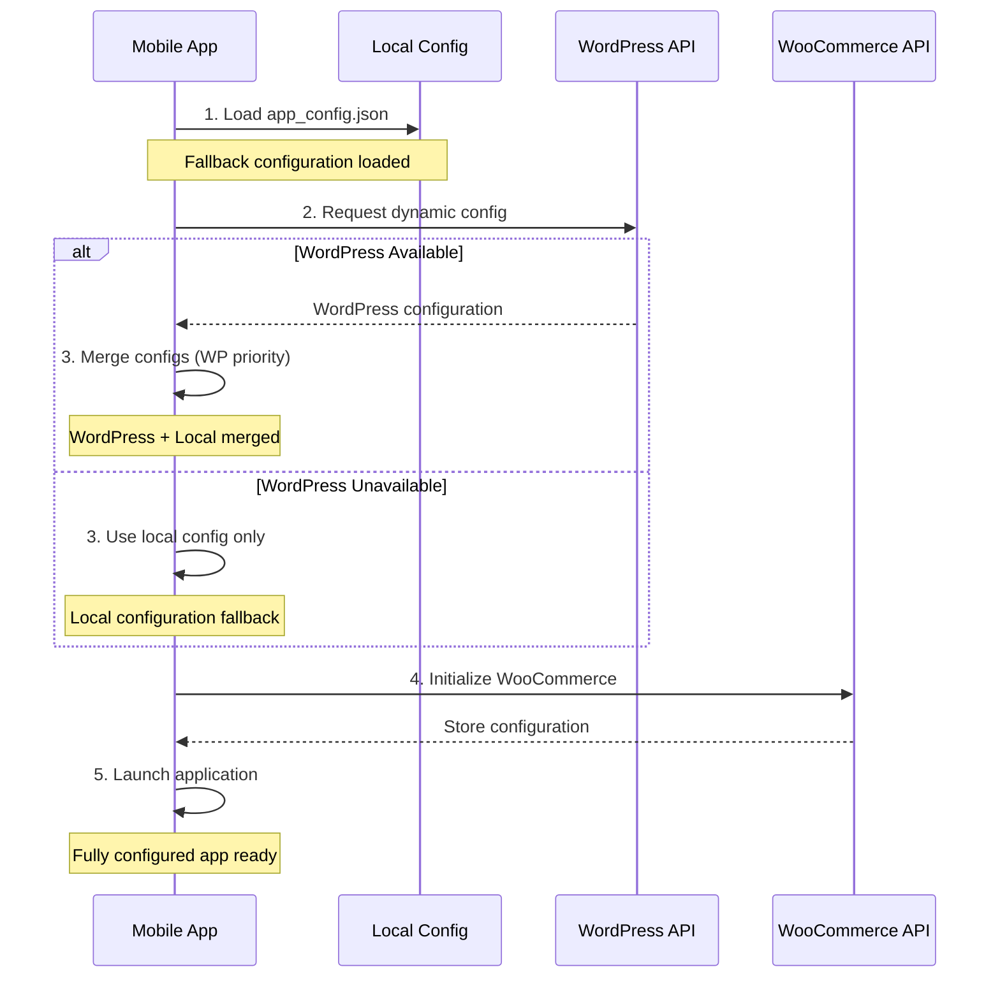

# 🛍️ OSMEA Storefront Woo

<p align="center">
  <a href="https://apps.apple.com/tr/app/masterfabric-store/id6757819630?l=tr"></a>
  &nbsp;
  <a href="https://play.google.com/store/apps/details?id=com.masterfabric.storefront"></a>
</p>

<div align="center">
  <a href="https://github.com/masterfabric-mobile/osmea"></a>
  <a href="pubspec.yaml"></a>
  <a href="https://flutter.dev"></a>
  <a href="https://woocommerce.com"></a>
</div>

<div style="margin-top: 1.5em; margin-bottom: 1.5em;"></div>

<br>

> **Complete E-commerce Mobile Application for WooCommerce**

<br>

<div style="margin-bottom: 1.5em;"></div>

[Overview](#-overview) • [Features](#-features) • [Tech Stack](#️-technology-stack) • [Getting Started](#-getting-started) • [Documentation](#-documentation) • [Contributing](#-contributing) • [Development & Help](#-development-deployment--help) • [License](#-license)

<br>

<details>
<summary>🌟 Overview</summary>

## 🌟 What is OSMEA Storefront WooCommerce?

**OSMEA Storefront WooCommerce** is a **production-ready, enterprise-grade e-commerce mobile application** built with Flutter and designed specifically for WooCommerce stores. It combines modern mobile UI/UX with powerful backend integration, advanced state management, and enterprise-level features.

### 🎯 **What Makes It Special**

- 🏪 **Complete WooCommerce Integration** - Full-featured mobile storefront for WordPress/WooCommerce
- 🧠 **Advanced State Management** - BLoC pattern with HydratedBloc for offline persistence
- 🌍 **Multi-Environment Support** - Development, staging, and production flavors
- 🔧 **WordPress Dynamic Config** - Real-time configuration from WordPress REST API
- 🌐 **i18n Ready** - Slang-based localization system with JSON translations
- 📱 **Cross-Platform** - iOS, Android, and Web support
- 🎨 **Modern UI/UX** - Material Design 3 with custom theming
- 💾 **Offline Capabilities** - Local storage with automatic sync
- 🏗️ **Clean Architecture** - Injectable DI with GetIt service locator
- 📦 **Type-Safe Assets** - FlutterGen for strongly typed asset references

### ⚡ **Perfect For**

- **WooCommerce Store Owners** - Ready-to-deploy mobile app for your store
- **Mobile App Agencies** - White-label solution for e-commerce clients
- **Enterprise Retailers** - Scalable architecture for large-scale operations
- **Flutter Developers** - Advanced reference implementation for e-commerce apps
- **WordPress Developers** - Seamless integration with WordPress/WooCommerce ecosystem

### 📊 Project Statistics

<div align="center">

| Metric | Value | Metric | Value |
|--------|-------|--------|-------|
| 🛒 **Platform** | WooCommerce | 📱 **Devices** | iOS, Android, Web |
| 🧠 **State Mgmt** | BLoC + Hydrated | 🌍 **i18n** | Slang (JSON-based) |
| 🎨 **UI Framework** | Material Design 3 | 🔧 **DI** | Injectable + GetIt |
| 📍 **Navigation** | GoRouter (Deep Links) | ⚡ **Environments** | Dev, Staging, Prod |
| 📦 **Views** | 8+ Feature Screens | 🧩 **Widgets** | 50+ Custom Components |
| 🔌 **WP Integration** | Dynamic Config | 💾 **Persistence** | Hydrated State |

**Version:** 1.0.0+1 | **Dart SDK:** ^3.8.1 | **Flutter:** 3.8+

</div>

</details>


<details>
<summary>✨ Features</summary>

## ✨ Complete Feature Set

### 🛒 **E-commerce Core Features**

<table>
<tr>
<td width="50%">

#### **Product Management**
- 📦 **Product Catalog** - Browse with advanced filtering & search
- 🔍 **Smart Search** - Real-time search with autocomplete
- 📊 **Product Details** - Rich pages with galleries & reviews
- 🏷️ **Categories & Tags** - Hierarchical categorization
- ⭐ **Customer Reviews** - Ratings and review system
- 🔄 **Product Variants** - Size, color, attribute support
- 🖼️ **Image Galleries** - Swipeable product images
- 📱 **Quick View** - Preview without leaving page

#### **Shopping Experience**
- 🛒 **Advanced Cart** - Quantity controls & management
- ❤️ **Wishlist/Favorites** - Persistent local storage
- 🔖 **Product Comparison** - Side-by-side comparison
- 🎯 **Recommendations** - Personalized suggestions
- 🔔 **Price Alerts** - Sale notifications
- 💰 **Coupon System** - Discount code application
- 🎁 **Gift Options** - Gift wrapping and messages

#### **Checkout & Payments**
- 💳 **Secure Checkout** - Multi-step with validation
- 🏠 **Address Management** - Billing & shipping storage
- 🚚 **Shipping Options** - Multiple methods & calculations
- 💰 **Payment Gateways** - Cards, PayPal, and more
- 🧾 **Order Summary** - Detailed review before payment
- ✅ **Order Confirmation** - Receipt system
- 📧 **Email Notifications** - Order status updates

</td>
<td width="50%">

#### **User Management**
- 🔐 **Secure Auth** - Email and social authentication
- 👤 **User Profiles** - Comprehensive account management
- 📧 **Email Verification** - Secure activation
- 🔒 **Password Management** - Reset and security
- 📱 **Social Login** - Google, Facebook, Apple
- 🎭 **Guest Checkout** - Purchase without account
- 📋 **Order History** - Complete purchase history
- 📦 **Order Tracking** - Real-time status updates

#### **Store Features**
- 🌐 **WordPress Integration** - Dynamic config from WP REST API
- 📊 **Config Merging** - Merge WordPress + local config
- 🔄 **Auto-Retry Logic** - Intelligent retry system
- ⚠️ **Fallback System** - Automatic local config fallback
- 📱 **Remote Feature Toggles** - Enable/disable remotely
- 🎨 **Dynamic Theming** - Brand colors from WordPress
- 🏪 **Multi-Store** - Support multiple stores

#### **Technical Features**
- 🧠 **BLoC Pattern** - Predictable state management
- 💾 **HydratedBloc** - State persistence
- 🔄 **Offline-First** - Works without internet
- 📦 **Type-Safe Assets** - FlutterGen integration
- 🌍 **Multi-Language** - Slang-based i18n
- 📱 **Deep Linking** - GoRouter integration
- 🎯 **Clean Architecture** - Layered design
- 🔧 **Dependency Injection** - Injectable + GetIt

</td>
</tr>
</table>

### 🎨 **UI/UX & Design Features**

#### **Modern Interface**
- 🎨 **Material Design 3** - Latest MD3 specifications
- 🌙 **Dark/Light Themes** - User preference-based theming
- 📱 **Responsive Design** - All screen sizes and orientations
- 🎯 **Accessibility** - WCAG compliant with screen reader support
- 🏃‍♂️ **Smooth Animations** - Fluid transitions and micro-interactions
- 🎭 **Custom Theming** - Brand-specific colors and typography

#### **Navigation & Flow**
- 🧭 **Declarative Navigation** - GoRouter-based deep linking
- 📍 **Deep Linking** - Direct links to products and categories
- 🔄 **State Restoration** - Restore session after app restart
- 📱 **Bottom Navigation** - Configurable with custom icons
- 🔍 **Global Search** - Accessible from anywhere
- 📚 **Breadcrumbs** - Clear navigation hierarchy

### 🌐 **Localization & Internationalization**

#### **Multi-Language Support**
- 🌍 **Slang Integration** - Advanced JSON-based translation
- 📝 **Build-Time Generation** - Compile-time optimization
- 🔄 **Dynamic Switching** - Change language without restart
- 📱 **RTL Support** - Right-to-left languages
- 💱 **Currency Formatting** - Locale-specific display
- 📅 **Date/Time Formatting** - Localized formats

#### **Regional Features**
- 🌏 **Region-Specific Content** - Show/hide by geography
- 💰 **Multi-Currency** - Support with conversion
- 📍 **Shipping Zones** - Region-based calculations
- 🏛️ **Tax Management** - Location-based tax
- 📞 **Contact Information** - Region-specific details

### ⚡ **Performance & Optimization**

#### **Performance Features**
- 🚀 **Fast Startup** - Optimized initialization
- 📱 **Memory Management** - Efficient usage and cleanup
- 🖼️ **Image Caching** - Smart caching with auto-cleanup
- 📶 **Network Optimization** - Request batching and caching
- 🎯 **Lazy Loading** - Load content when needed
- 📊 **Performance Monitoring** - Built-in analytics

#### **Offline Capabilities**
- 💾 **Local Storage** - Comprehensive offline data
- 🔄 **Sync Management** - Auto-sync when connected
- 📦 **Cached Products** - Browse offline
- 🛒 **Offline Cart** - Maintain cart without internet
- 📱 **Progressive Loading** - Graceful degradation
- 🔔 **Connectivity Monitoring** - Real-time status

### 📱 Application Screens

**Core Screens:** Splash, Onboarding, Welcome, Product Catalog, Product Details, Shopping Cart, Checkout, User Profile.

**Additional:** Search, Categories, Wishlist, Order History, Settings.

### 🎯 Use Cases

**E-commerce:** Online stores, retail chains, marketplaces, B2B. **End users:** Mobile shopping, product discovery, secure payments, order tracking. **Developers:** Flutter/BLoC learning, API integration.

### 🛠️ Development (code gen & build)

```bash
# Code generation
flutter packages pub run build_runner build
flutter packages pub run slang_build_runner build
flutter packages pub run flutter_gen_runner

# Test & build
flutter test
flutter build apk --flavor prod --release
flutter build ios --flavor prod --release
```

</details>


<details>
<summary>🛠️ Technology Stack</summary>

## 🛠️ Advanced Technology Stack

### **Frontend Framework & UI**
- **Flutter 3.8+** - Latest Flutter SDK with performance improvements
- **Dart 3.8+** - Modern Dart with null safety and pattern matching
- **Material Design 3** - Latest Material Design specification
- **Cupertino Icons 1.0.8** - iOS-style icons for platform consistency

### **State Management & Architecture**
- **BLoC Pattern 9.1.1** - Predictable state management with business logic separation
- **HydratedBloc** - Automatic state persistence to device storage
- **Injectable 2.7.1** - Annotation-based dependency injection with code generation
- **GetIt 8.3.0** - Service locator pattern for dependency management
- **Clean Architecture** - Layered architecture with clear boundaries

### **Navigation & Routing**
- **GoRouter 15.1.3** - Declarative routing with deep linking capabilities
- **Route Generation** - Type-safe route definitions with parameters
- **Deep Linking** - URL-based navigation for web and mobile
- **Navigation Guards** - Authentication-based route protection

### **Backend Integration**
- **OSMEA APIs Package** - Internal WooCommerce API abstraction layer
- **WooCommerce REST API** - Full integration with WooCommerce endpoints
- **WordPress REST API** - Dynamic configuration and content management
- **HTTP Client** - Advanced HTTP handling with interceptors and retry logic

### **Environment & Configuration**
- **Flavor 2.0.0** - Multi-environment support (dev/staging/production)
- **Flutter DotEnv 5.1.0** - Environment variable management
- **WordPress Config Service** - Dynamic configuration from WordPress
- **Config Merging** - Intelligent merging of remote and local configurations

### **Localization & i18n**
- **Slang 4.11.1** - Advanced JSON-based translation system
- **Slang Flutter 4.11.0** - Flutter bindings for translation integration
- **Build Runner Integration** - Compile-time translation generation
- **Slang Build Runner 4.7.0** - Automated translation code generation

### **Code Generation & Tooling**
- **Flutter Gen 5.10.0** - Type-safe asset reference generation
- **Build Runner 2.5.4** - Comprehensive code generation framework
- **Injectable Generator 2.7.0** - Dependency injection code generation
- **Flutter Gen Runner** - Asset and resource code generation
- **Flutter Launcher Icons 0.14.4** - App icon generation for all platforms

### **Quality & Testing**
- **Flutter Lints 5.0.0** - Comprehensive linting rules for code quality
- **Flutter Test Framework** - Unit, widget, and integration testing
- **Analysis Options** - Custom linting configuration for enterprise standards

### 🏗️ Architecture Overview

### **Clean Architecture Layers**



### **Configuration Management Flow**



### **Architecture Principles**

- **Clean Architecture** - Clear separation between layers
- **SOLID Principles** - Maintainable and extensible code
- **BLoC Pattern** - Predictable state management with events and states
- **Dependency Injection** - Loose coupling with Injectable annotations
- **Repository Pattern** - Abstract data source implementations
- **Service Layer** - Business logic encapsulation
- **Configuration-Driven** - Feature flags and remote configuration

### 📂 Project Structure

`storefront_woo/` → `lib/` (main, core, features), `assets/`, `test/`, `integration_test/`. Features: home, products, cart, checkout, auth, profile, categories, wishlist. Each feature: presentation (blocs, pages, widgets), domain (entities, repositories), data (models, repositories).

</details>


<details>
<summary>🚀 Getting Started</summary>

## 🚀 Getting Started

### 📋 **Prerequisites & Requirements**

```bash
# Required Software & Versions
Flutter SDK: >=3.8.1
Dart SDK: >=3.8.1
Git: Latest version
Android Studio or VS Code with Flutter extensions

# Platform-Specific Requirements
For iOS Development:
- Xcode 14+ (macOS only)
- iOS Simulator or physical device
- Apple Developer Account (for device testing)

For Android Development:
- Android SDK 21+ (Android 5.0+)
- Android Emulator or physical device
- Java Development Kit (JDK) 11+

For Web Development:
- Chrome or other modern browser
- Web server for production deployment
```

### ⚡ **Quick Installation & Setup**

#### **Option 1: Complete OSMEA Ecosystem Setup** (Recommended)

```bash
# Clone the full OSMEA repository
git clone https://github.com/masterfabric-mobile/osmea.git
cd osmea

# Navigate to Storefront WooCommerce project
cd projects/storefront_woo

# Install all dependencies (including internal packages)
flutter pub get

# Generate dependency injection and asset code
dart run build_runner build --delete-conflicting-outputs

# Generate localization files
dart run slang_build_runner build

# Generate app icons for all platforms
flutter packages pub run flutter_launcher_icons:main

# Run in development environment
flutter run --flavor dev

# Or run in production environment
flutter run --flavor prod
```

#### **Option 2: Development Environment Setup**

```bash
# For active development with auto-generation
flutter run --flavor dev --debug

# Watch for code generation changes (in separate terminal)
dart run build_runner watch

# Hot reload support for faster development
flutter run --flavor dev --hot

# Debug mode with comprehensive logging
flutter run --flavor dev --verbose
```

### 🔧 **Environment Configuration**

#### **Development Environment (Flavor: dev)**
```bash
# Run development build with green theming and debug features
flutter run --flavor dev --debug

# Build development APK
flutter build apk --flavor dev --debug

# Build development iOS app
flutter build ios --flavor dev --debug

# Development features:
# - Green theme color for environment identification
# - Debug logging enabled
# - Development API endpoints
# - Hot reload support
# - DevTools integration
```

#### **Production Environment (Flavor: prod)**
```bash
# Run production build with optimizations
flutter run --flavor prod --release

# Build production APK
flutter build apk --flavor prod --release

# Build production iOS app
flutter build ios --flavor prod --release

# Build App Bundle for Google Play
flutter build appbundle --flavor prod --release

# Production features:
# - Brand theme colors
# - Production API endpoints
# - Analytics enabled
# - Optimized performance
# - Code obfuscation
```

### 📝 **Configuration Files Setup**

#### **1. App Configuration (assets/app_config.json)**

```json
{
  "app": {
    "name": "Your Store Name",
    "version": "1.0.0",
    "environment": "production",
    "debug_mode": false
  },
  "woocommerce": {
    "base_url": "https://yourstore.com",
    "consumer_key": "ck_your_consumer_key",
    "consumer_secret": "cs_your_consumer_secret",
    "timeout": 30000
  },
  "wordpress": {
    "base_url": "https://yourstore.com",
    "rest_api_enabled": true,
    "config_endpoint": "/wp-json/osmea/v1/app-config",
    "enable_remote_config": true,
    "cache_duration": 3600
  },
  "features": {
    "wishlist_enabled": true,
    "guest_checkout_enabled": true,
    "reviews_enabled": true,
    "social_login_enabled": true,
    "push_notifications_enabled": true
  },
  "ui": {
    "theme": "light",
    "primary_color": "#2196F3",
    "accent_color": "#FF5722"
  },
  "performance": {
    "image_cache_size": 100,
    "network_timeout": 30000,
    "retry_attempts": 3,
    "enable_lazy_loading": true
  }
}
```

#### **2. Environment Variables (.env)**

```env
# Development Environment
ENVIRONMENT=development
API_BASE_URL=https://staging.yourstore.com
ENABLE_LOGGING=true
ANALYTICS_ENABLED=false

# Production Environment
ENVIRONMENT=production
API_BASE_URL=https://yourstore.com
ENABLE_LOGGING=false
ANALYTICS_ENABLED=true
```

### 🏗️ **WordPress Integration Setup**

#### **WooCommerce API Configuration**

```bash
# Generate WooCommerce API keys
1. Go to WooCommerce → Settings → Advanced → REST API
2. Click "Add Key"
3. Set permissions to "Read/Write"
4. Set user to Administrator
5. Copy Consumer Key and Consumer Secret
6. Update app_config.json with your credentials
```

#### **WordPress REST API Endpoint Setup**

Create a custom WordPress plugin for OSMEA configuration:

```php
<?php
/**
 * Plugin Name: OSMEA App Configuration
 * Description: Provides REST API endpoints for OSMEA mobile app
 * Version: 1.0.0
 */

// Register REST API endpoints
add_action('rest_api_init', 'osmea_register_routes');

function osmea_register_routes() {
    register_rest_route('osmea/v1', '/app-config', array(
        'methods' => 'GET',
        'callback' => 'osmea_get_app_config',
        'permission_callback' => '__return_true'
    ));
}

function osmea_get_app_config() {
    return array(
        'app' => array(
            'name' => get_option('osmea_app_name', 'Your Store'),
            'theme_color' => get_option('osmea_theme_color', '#2196F3')
        ),
        'features' => array(
            'wishlist_enabled' => get_option('osmea_wishlist', true),
            'guest_checkout' => get_option('osmea_guest_checkout', true),
            'reviews_enabled' => get_option('osmea_reviews', true)
        ),
        'woocommerce' => array(
            'currency' => get_woocommerce_currency(),
            'currency_symbol' => get_woocommerce_currency_symbol(),
            'store_url' => home_url()
        )
    );
}
```

### 📱 **Platform-Specific Builds**

#### **Android Build**

```bash
# Debug build
flutter build apk --flavor dev --debug

# Release build with signing
flutter build apk --flavor prod --release

# App Bundle for Google Play
flutter build appbundle --flavor prod --release

# Install on connected device
flutter install --flavor prod
```

#### **iOS Build**

```bash
# Debug build
flutter build ios --flavor dev --debug

# Release build
flutter build ios --flavor prod --release

# Archive for App Store
flutter build ipa --flavor prod --release

# Open in Xcode for signing
open ios/Runner.xcworkspace
```

#### **Web Build**

```bash
# Build for web deployment
flutter build web --release --web-renderer html

# Build with CanvasKit renderer
flutter build web --release --web-renderer canvaskit

# Serve locally for testing
flutter run -d chrome
```

### 🧪 **Testing & Validation**

```bash
# Run all unit tests
flutter test

# Run tests with coverage
flutter test --coverage

# Run specific test file
flutter test test/models/navbar_item_model_test.dart

# Analyze code quality
flutter analyze

# Format code
flutter format .

# Check dependencies
flutter pub deps
```

---
- **Production** (`main_prod.dart`): Blue theme, production settings

### **Build Variants**

```bash
# Development builds
flutter build apk --flavor dev
flutter build ios --flavor dev

# Production builds
flutter build apk --flavor prod
flutter build ios --flavor prod
```

</details>


<details>
<summary>📚 Documentation</summary>

- **Monorepo:** [github.com/masterfabric-mobile/osmea](https://github.com/masterfabric-mobile/osmea)
- **Docs:** [OSMEA Documentation](https://github.com/masterfabric-mobile/osmea/tree/dev/docs)
- **Report issues:** [GitHub Issues](https://github.com/masterfabric-mobile/osmea/issues)
- **Discussions:** [GitHub Discussions](https://github.com/masterfabric-mobile/osmea/discussions)
- **OSMEA Home:** [README](../../README.md)

</details>


<details>
<summary>🤝 Contributing</summary>

## 🤝 Contributing

We welcome contributions! Here's how you can help:

### **Development Guidelines**
- **Code Style**: Follow Dart/Flutter conventions
- **Testing**: Write tests for new features
- **Documentation**: Update docs for API changes
- **Commit Messages**: Use conventional commits

### **How to Contribute**
1. **Fork the Repository**
2. **Create a Feature Branch**
3. **Make Your Changes**
4. **Submit a Pull Request**

</details>


<details>
<summary>📖 Development, Deployment & Help</summary>

### 🧑‍💻 Development Guide

### **1. BLoC Pattern Implementation**

#### **Creating a New BLoC**

```dart
// lib/features/products/presentation/blocs/product_list_bloc.dart

import 'package:flutter_bloc/flutter_bloc.dart';
import 'package:injectable/injectable.dart';
import '../../domain/repositories/product_repository.dart';

// Events
abstract class ProductListEvent {}

class LoadProductsEvent extends ProductListEvent {
  final int page;
  final String? category;
  
  LoadProductsEvent({this.page = 1, this.category});
}

class SearchProductsEvent extends ProductListEvent {
  final String query;
  
  SearchProductsEvent(this.query);
}

// States
abstract class ProductListState {}

class ProductListInitial extends ProductListState {}

class ProductListLoading extends ProductListState {}

class ProductListLoaded extends ProductListState {
  final List<Product> products;
  final bool hasMore;
  
  ProductListLoaded(this.products, {this.hasMore = false});
}

class ProductListError extends ProductListState {
  final String message;
  
  ProductListError(this.message);
}

// BLoC
@injectable
class ProductListBloc extends Bloc<ProductListEvent, ProductListState> {
  final ProductRepository _repository;
  
  ProductListBloc(this._repository) : super(ProductListInitial()) {
    on<LoadProductsEvent>(_onLoadProducts);
    on<SearchProductsEvent>(_onSearchProducts);
  }
  
  Future<void> _onLoadProducts(
    LoadProductsEvent event,
    Emitter<ProductListState> emit,
  ) async {
    emit(ProductListLoading());
    
    try {
      final products = await _repository.getProducts(
        page: event.page,
        category: event.category,
      );
      
      emit(ProductListLoaded(products, hasMore: products.length >= 20));
    } catch (e) {
      emit(ProductListError('Failed to load products: $e'));
    }
  }
  
  Future<void> _onSearchProducts(
    SearchProductsEvent event,
    Emitter<ProductListState> emit,
  ) async {
    emit(ProductListLoading());
    
    try {
      final products = await _repository.searchProducts(event.query);
      emit(ProductListLoaded(products));
    } catch (e) {
      emit(ProductListError('Search failed: $e'));
    }
  }
}
```

#### **Using BLoC in a Widget**

```dart
// lib/features/products/presentation/pages/product_list_page.dart

import 'package:flutter/material.dart';
import 'package:flutter_bloc/flutter_bloc.dart';
import '../blocs/product_list_bloc.dart';
import '../widgets/product_card.dart';

class ProductListPage extends StatelessWidget {
  const ProductListPage({super.key});
  
  @override
  Widget build(BuildContext context) {
    return BlocProvider(
      create: (context) => getIt<ProductListBloc>()
        ..add(LoadProductsEvent()),
      child: const ProductListView(),
    );
  }
}

class ProductListView extends StatelessWidget {
  const ProductListView({super.key});
  
  @override
  Widget build(BuildContext context) {
    return Scaffold(
      appBar: AppBar(
        title: const Text('Products'),
        actions: [
          IconButton(
            icon: const Icon(Icons.search),
            onPressed: () => _showSearch(context),
          ),
        ],
      ),
      body: BlocBuilder<ProductListBloc, ProductListState>(
        builder: (context, state) {
          if (state is ProductListLoading) {
            return const Center(child: CircularProgressIndicator());
          }
          
          if (state is ProductListError) {
            return Center(
              child: Column(
                mainAxisAlignment: MainAxisAlignment.center,
                children: [
                  Text(state.message),
                  ElevatedButton(
                    onPressed: () => context.read<ProductListBloc>()
                      .add(LoadProductsEvent()),
                    child: const Text('Retry'),
                  ),
                ],
              ),
            );
          }
          
          if (state is ProductListLoaded) {
            return GridView.builder(
              padding: const EdgeInsets.all(16),
              gridDelegate: const SliverGridDelegateWithFixedCrossAxisCount(
                crossAxisCount: 2,
                childAspectRatio: 0.7,
                crossAxisSpacing: 16,
                mainAxisSpacing: 16,
              ),
              itemCount: state.products.length,
              itemBuilder: (context, index) {
                return ProductCard(product: state.products[index]);
              },
            );
          }
          
          return const SizedBox.shrink();
        },
      ),
    );
  }
  
  void _showSearch(BuildContext context) {
    showSearch(
      context: context,
      delegate: ProductSearchDelegate(
        context.read<ProductListBloc>(),
      ),
    );
  }
}
```

### **2. Adding a New Feature**

#### **Step-by-Step Process**

1. **Create Feature Directory Structure**

```bash
mkdir -p lib/features/my_feature/{presentation/{blocs,pages,widgets},domain/{entities,repositories},data/{models,repositories}}
```

2. **Define Domain Entities**

```dart
// lib/features/my_feature/domain/entities/my_entity.dart

class MyEntity {
  final String id;
  final String name;
  
  const MyEntity({
    required this.id,
    required this.name,
  });
}
```

3. **Create Repository Interface**

```dart
// lib/features/my_feature/domain/repositories/my_repository.dart

abstract class MyRepository {
  Future<List<MyEntity>> getItems();
  Future<MyEntity> getItemById(String id);
}
```

4. **Implement BLoC**

```dart
// lib/features/my_feature/presentation/blocs/my_bloc.dart

@injectable
class MyBloc extends Bloc<MyEvent, MyState> {
  final MyRepository _repository;
  
  MyBloc(this._repository) : super(MyInitial()) {
    on<LoadItemsEvent>(_onLoadItems);
  }
  
  Future<void> _onLoadItems(
    LoadItemsEvent event,
    Emitter<MyState> emit,
  ) async {
    // Implementation
  }
}
```

5. **Create UI Pages**

```dart
// lib/features/my_feature/presentation/pages/my_page.dart

class MyPage extends StatelessWidget {
  @override
  Widget build(BuildContext context) {
    return BlocProvider(
      create: (context) => getIt<MyBloc>()..add(LoadItemsEvent()),
      child: const MyView(),
    );
  }
}
```

6. **Register with Dependency Injection**

```dart
// lib/core/di/injectable.dart

@module
abstract class FeatureModule {
  @injectable
  MyRepository get myRepository => MyRepositoryImpl();
}
```

7. **Add Routes**

```dart
// lib/core/router/app_router.dart

final appRouter = GoRouter(
  routes: [
    // ... existing routes
    GoRoute(
      path: '/my-feature',
      builder: (context, state) => const MyPage(),
    ),
  ],
);
```

8. **Regenerate Code**

```bash
flutter pub run build_runner build --delete-conflicting-outputs
```

### **3. Localization Implementation**

#### **Adding Translations**

1. **Add Translation Keys**

```json
// assets/l10n/translations_en.i18n.json
{
  "products": {
    "title": "Products",
    "search": "Search products",
    "no_results": "No products found",
    "load_more": "Load More"
  },
  "cart": {
    "title": "Shopping Cart",
    "empty": "Your cart is empty",
    "total": "Total: {amount}",
    "checkout": "Proceed to Checkout"
  }
}
```

```json
// assets/l10n/translations_tr.i18n.json
{
  "products": {
    "title": "Ürünler",
    "search": "Ürün ara",
    "no_results": "Ürün bulunamadı",
    "load_more": "Daha Fazla Yükle"
  },
  "cart": {
    "title": "Alışveriş Sepeti",
    "empty": "Sepetiniz boş",
    "total": "Toplam: {amount}",
    "checkout": "Ödemeye Geç"
  }
}
```

2. **Generate Translation Code**

```bash
flutter pub run build_runner build --delete-conflicting-outputs
```

3. **Use in Widgets**

```dart
import 'package:storefront_woo/l10n/translations.g.dart';

class ProductListPage extends StatelessWidget {
  @override
  Widget build(BuildContext context) {
    final t = Translations.of(context);
    
    return Scaffold(
      appBar: AppBar(
        title: Text(t.products.title),
      ),
      body: Column(
        children: [
          TextField(
            decoration: InputDecoration(
              hintText: t.products.search,
            ),
          ),
          // ... product list
        ],
      ),
    );
  }
}
```

### **4. Testing Strategy**

#### **Unit Tests**

```dart
// test/features/products/blocs/product_list_bloc_test.dart

import 'package:flutter_test/flutter_test.dart';
import 'package:mockito/mockito.dart';

void main() {
  late ProductListBloc bloc;
  late MockProductRepository mockRepository;
  
  setUp(() {
    mockRepository = MockProductRepository();
    bloc = ProductListBloc(mockRepository);
  });
  
  group('ProductListBloc', () {
    test('initial state is ProductListInitial', () {
      expect(bloc.state, isA<ProductListInitial>());
    });
    
    test('emits [Loading, Loaded] when LoadProductsEvent is added', () async {
      final products = [Product(id: '1', name: 'Test Product')];
      when(mockRepository.getProducts()).thenAnswer((_) async => products);
      
      final expected = [
        ProductListLoading(),
        ProductListLoaded(products),
      ];
      
      expectLater(bloc.stream, emitsInOrder(expected));
      
      bloc.add(LoadProductsEvent());
    });
  });
}
```

#### **Widget Tests**

```dart
// test/features/products/widgets/product_card_test.dart

import 'package:flutter_test/flutter_test.dart';

void main() {
  testWidgets('ProductCard displays product information', (tester) async {
    final product = Product(
      id: '1',
      name: 'Test Product',
      price: 99.99,
    );
    
    await tester.pumpWidget(
      MaterialApp(
        home: Scaffold(
          body: ProductCard(product: product),
        ),
      ),
    );
    
    expect(find.text('Test Product'), findsOneWidget);
    expect(find.text('\$99.99'), findsOneWidget);
  });
}
```

#### **Integration Tests**

```dart
// integration_test/app_test.dart

import 'package:flutter_test/flutter_test.dart';
import 'package:integration_test/integration_test.dart';

void main() {
  IntegrationTestWidgetsFlutterBinding.ensureInitialized();
  
  testWidgets('complete shopping flow', (tester) async {
    app.main();
    await tester.pumpAndSettle();
    
    // Navigate to products
    await tester.tap(find.text('Products'));
    await tester.pumpAndSettle();
    
    // Add product to cart
    await tester.tap(find.byIcon(Icons.add_shopping_cart).first);
    await tester.pumpAndSettle();
    
    // Go to cart
    await tester.tap(find.byIcon(Icons.shopping_cart));
    await tester.pumpAndSettle();
    
    // Verify cart contains product
    expect(find.text('Test Product'), findsOneWidget);
  });
}
```

### **5. Code Generation Commands**

```bash
# Generate all code (DI, translations, assets)
flutter pub run build_runner build --delete-conflicting-outputs

# Watch mode for development
flutter pub run build_runner watch --delete-conflicting-outputs

# Generate only translations
flutter pub run slang

# Generate only assets
flutter pub run flutter_gen

# Clean generated code
flutter pub run build_runner clean
```

### 📦 Deployment Guide

### **1. Google Play Store (Android)**

#### **Preparation**

```bash
# Build release APK
flutter build apk --release --flavor prod -t lib/main_prod.dart

# Build App Bundle (recommended for Play Store)
flutter build appbundle --release --flavor prod -t lib/main_prod.dart
```

#### **Play Store Configuration**

```yaml
# android/app/build.gradle

android {
    defaultConfig {
        applicationId "com.osmea.storefront"
        minSdkVersion 21
        targetSdkVersion 34
        versionCode 1
        versionName "1.0.0"
    }
    
    signingConfigs {
        release {
            storeFile file(System.getenv("KEYSTORE_FILE"))
            storePassword System.getenv("KEYSTORE_PASSWORD")
            keyAlias System.getenv("KEY_ALIAS")
            keyPassword System.getenv("KEY_PASSWORD")
        }
    }
    
    buildTypes {
        release {
            signingConfig signingConfigs.release
            minifyEnabled true
            shrinkResources true
            proguardFiles getDefaultProguardFile('proguard-android-optimize.txt'), 'proguard-rules.pro'
        }
    }
    
    flavorDimensions "environment"
    productFlavors {
        dev {
            dimension "environment"
            applicationIdSuffix ".dev"
            versionNameSuffix "-dev"
        }
        prod {
            dimension "environment"
        }
    }
}
```

#### **Release Management**

1. **Create Keystore**

```bash
keytool -genkey -v -keystore ~/storefront-release.jks -keyalg RSA -keysize 2048 -validity 10000 -alias storefront
```

2. **Set Environment Variables**

```bash
export KEYSTORE_FILE=~/storefront-release.jks
export KEYSTORE_PASSWORD=your_password
export KEY_ALIAS=storefront
export KEY_PASSWORD=your_key_password
```

3. **Build and Upload**

```bash
flutter build appbundle --release --flavor prod -t lib/main_prod.dart
# Upload build/app/outputs/bundle/prodRelease/app-prod-release.aab to Play Console
```

---

### **2. Apple App Store (iOS)**

#### **Build Process**

```bash
# Clean previous builds
flutter clean

# Get dependencies
flutter pub get

# Build for iOS
flutter build ios --release --flavor prod -t lib/main_prod.dart
```

#### **App Store Connect Configuration**

1. **Update ios/Runner/Info.plist**

```xml
<key>CFBundleDisplayName</key>
<string>OSMEA Storefront</string>
<key>CFBundleIdentifier</key>
<string>com.osmea.storefront</string>
<key>CFBundleVersion</key>
<string>1</string>
<key>CFBundleShortVersionString</key>
<string>1.0.0</string>
```

2. **Xcode Project Setup**

```bash
# Open Xcode
open ios/Runner.xcworkspace

# Configure:
# - Signing & Capabilities
# - Bundle Identifier: com.osmea.storefront
# - Team: Your Development Team
# - Provisioning Profile: App Store Distribution
```

3. **Create Archive**

- In Xcode: Product → Archive
- Validate App
- Distribute App → App Store Connect
- Upload

#### **TestFlight & Review**

- TestFlight: Automatic after upload
- App Store Review: Submit through App Store Connect

---

### **3. Web Deployment**

#### **Vercel Deployment**

```bash
# Install Vercel CLI
npm install -g vercel

# Build for web
flutter build web --release --flavor prod -t lib/main_prod.dart

# Deploy
cd build/web
vercel --prod
```

**vercel.json**

```json
{
  "version": 2,
  "builds": [
    {
      "src": "**",
      "use": "@vercel/static"
    }
  ],
  "routes": [
    {
      "src": "/(.*)",
      "dest": "/$1"
    }
  ]
}
```

#### **Netlify Deployment**

```bash
# Build for web
flutter build web --release --flavor prod -t lib/main_prod.dart

# Deploy using Netlify CLI
npm install -g netlify-cli
cd build/web
netlify deploy --prod
```

**netlify.toml**

```toml
[build]
  publish = "build/web"
  command = "flutter build web --release --flavor prod -t lib/main_prod.dart"

[[redirects]]
  from = "/*"
  to = "/index.html"
  status = 200
```

#### **Firebase Hosting**

```bash
# Install Firebase CLI
npm install -g firebase-tools

# Initialize Firebase
firebase init hosting

# Build and deploy
flutter build web --release --flavor prod -t lib/main_prod.dart
firebase deploy --only hosting
```

**firebase.json**

```json
{
  "hosting": {
    "public": "build/web",
    "ignore": [
      "firebase.json",
      "**/.*",
      "**/node_modules/**"
    ],
    "rewrites": [
      {
        "source": "**",
        "destination": "/index.html"
      }
    ]
  }
}
```

---

### **4. WordPress Integration Deployment**

#### **Plugin Setup**

```php
<?php
/**
 * Plugin Name: OSMEA App Config Manager
 * Description: Manage mobile app configuration dynamically
 * Version: 1.0.0
 * Author: OSMEA Team
 */

add_action('rest_api_init', function () {
    register_rest_route('osmea/v1', '/app-config', array(
        'methods' => 'GET',
        'callback' => 'osmea_get_app_config',
        'permission_callback' => '__return_true'
    ));
});

function osmea_get_app_config() {
    $config = array(
        'features' => array(
            'wishlistEnabled' => get_option('osmea_wishlist_enabled', true),
            'guestCheckoutEnabled' => get_option('osmea_guest_checkout', true),
            'socialLoginEnabled' => get_option('osmea_social_login', false),
            'multiLanguageEnabled' => get_option('osmea_multi_language', true)
        ),
        'theme' => array(
            'primaryColor' => get_option('osmea_primary_color', '#2196F3'),
            'accentColor' => get_option('osmea_accent_color', '#FF5722'),
            'darkModeEnabled' => get_option('osmea_dark_mode', true)
        ),
        'api' => array(
            'baseUrl' => get_option('siteurl'),
            'woocommerceUrl' => get_option('siteurl') . '/wp-json/wc/v3',
            'consumerKey' => get_option('osmea_woo_consumer_key'),
            'timeout' => get_option('osmea_api_timeout', 30)
        ),
        'payment' => array(
            'enabledGateways' => osmea_get_enabled_payment_gateways(),
            'currency' => get_woocommerce_currency(),
            'currencySymbol' => get_woocommerce_currency_symbol()
        ),
        'shipping' => array(
            'zones' => osmea_get_shipping_zones(),
            'freeShippingThreshold' => get_option('osmea_free_shipping_threshold', 0)
        )
    );
    
    return rest_ensure_response($config);
}

function osmea_get_enabled_payment_gateways() {
    $gateways = WC()->payment_gateways->get_available_payment_gateways();
    $enabled = array();
    
    foreach ($gateways as $gateway) {
        if ($gateway->enabled === 'yes') {
            $enabled[] = array(
                'id' => $gateway->id,
                'title' => $gateway->title,
                'description' => $gateway->description
            );
        }
    }
    
    return $enabled;
}

function osmea_get_shipping_zones() {
    $zones = WC_Shipping_Zones::get_zones();
    $zone_data = array();
    
    foreach ($zones as $zone) {
        $zone_data[] = array(
            'id' => $zone['id'],
            'name' => $zone['zone_name'],
            'locations' => $zone['zone_locations'],
            'methods' => osmea_get_zone_shipping_methods($zone['id'])
        );
    }
    
    return $zone_data;
}

function osmea_get_zone_shipping_methods($zone_id) {
    $zone = new WC_Shipping_Zone($zone_id);
    $methods = $zone->get_shipping_methods(true);
    $method_data = array();
    
    foreach ($methods as $method) {
        $method_data[] = array(
            'id' => $method->id,
            'title' => $method->title,
            'cost' => $method->get_option('cost', 0)
        );
    }
    
    return $method_data;
}

// Admin settings page
add_action('admin_menu', function () {
    add_options_page(
        'OSMEA App Config',
        'OSMEA App',
        'manage_options',
        'osmea-app-config',
        'osmea_render_admin_page'
    );
});

function osmea_render_admin_page() {
    ?>
    <div class="wrap">
        <h1>OSMEA App Configuration</h1>
        <form method="post" action="options.php">
            <?php
            settings_fields('osmea_settings');
            do_settings_sections('osmea-app-config');
            submit_button();
            ?>
        </form>
    </div>
    <?php
}

// Register settings
add_action('admin_init', function () {
    register_setting('osmea_settings', 'osmea_wishlist_enabled');
    register_setting('osmea_settings', 'osmea_guest_checkout');
    register_setting('osmea_settings', 'osmea_social_login');
    register_setting('osmea_settings', 'osmea_primary_color');
    register_setting('osmea_settings', 'osmea_accent_color');
    register_setting('osmea_settings', 'osmea_woo_consumer_key');
    register_setting('osmea_settings', 'osmea_api_timeout');
    
    // Add settings sections and fields
    add_settings_section(
        'osmea_features_section',
        'Feature Configuration',
        null,
        'osmea-app-config'
    );
    
    add_settings_field(
        'osmea_wishlist_enabled',
        'Enable Wishlist',
        'osmea_render_checkbox_field',
        'osmea-app-config',
        'osmea_features_section',
        array('name' => 'osmea_wishlist_enabled')
    );
    
    // Add more fields as needed...
});

function osmea_render_checkbox_field($args) {
    $value = get_option($args['name'], true);
    ?>
    <input type="checkbox" name="<?php echo esc_attr($args['name']); ?>" value="1" <?php checked($value, 1); ?>>
    <?php
}
?>
```

#### **Deploy Plugin**

1. **Upload to WordPress**

```bash
# Create plugin zip
cd docs/plugins/osmea-app-config-manager
zip -r osmea-app-config-manager.zip .

# Upload via WordPress Admin:
# Plugins → Add New → Upload Plugin → Choose File → Install Now
```

2. **Activate Plugin**

- Navigate to Plugins → Installed Plugins
- Activate "OSMEA App Config Manager"
- Configure settings in Settings → OSMEA App

---

### **5. Environment Management**

#### **Production Configuration**

**.env.prod**

```bash
# API Configuration
WORDPRESS_BASE_URL=https://yourstore.com
WOOCOMMERCE_API_URL=https://yourstore.com/wp-json/wc/v3
CONSUMER_KEY=ck_production_key_here
CONSUMER_SECRET=cs_production_secret_here

# Feature Flags
ENABLE_ANALYTICS=true
ENABLE_CRASH_REPORTING=true
ENABLE_DEBUG_MODE=false

# Performance
API_TIMEOUT=30
MAX_CACHE_SIZE=100

# Security
ENABLE_SSL_PINNING=true
API_VERSION=v3
```

#### **Performance Optimization**

```dart
// lib/core/config/performance_config.dart

class PerformanceConfig {
  // Image caching
  static const int maxCacheSize = 100 * 1024 * 1024; // 100 MB
  static const Duration cacheValidDuration = Duration(days: 7);
  
  // Network
  static const Duration connectTimeout = Duration(seconds: 30);
  static const Duration receiveTimeout = Duration(seconds: 30);
  static const int maxRetryAttempts = 3;
  
  // Pagination
  static const int productsPerPage = 20;
  static const int ordersPerPage = 10;
  
  // Preloading
  static const int preloadDistance = 3; // Pages
  static const bool enableImagePrecaching = true;
  
  // State persistence
  static const bool enableStatePersistence = true;
  static const Duration stateSaveDebounce = Duration(milliseconds: 500);
}
```

---

### **6. Security & Compliance**

#### **Security Checklist**

- [ ] SSL/TLS pinning implemented
- [ ] API keys stored securely (not in source code)
- [ ] Input validation on all forms
- [ ] XSS protection in web views
- [ ] Secure data storage (encrypted SharedPreferences)
- [ ] Authentication token refresh mechanism
- [ ] Rate limiting on API calls
- [ ] Obfuscation enabled for production builds
- [ ] ProGuard/R8 enabled for Android
- [ ] Code signing certificates secured

#### **GDPR Compliance**

```dart
// lib/features/settings/presentation/pages/privacy_settings_page.dart

class PrivacySettingsPage extends StatelessWidget {
  @override
  Widget build(BuildContext context) {
    return Scaffold(
      appBar: AppBar(title: const Text('Privacy Settings')),
      body: ListView(
        children: [
          SwitchListTile(
            title: const Text('Analytics'),
            subtitle: const Text('Help us improve the app'),
            value: _analyticsEnabled,
            onChanged: (value) => _updateAnalytics(value),
          ),
          ListTile(
            title: const Text('Data Export'),
            subtitle: const Text('Download your data'),
            onTap: () => _exportUserData(),
          ),
          ListTile(
            title: const Text('Delete Account'),
            subtitle: const Text('Permanently delete your account'),
            onTap: () => _showDeleteConfirmation(),
          ),
        ],
      ),
    );
  }
}
```

#### **Mobile Security Best Practices**

```dart
// lib/core/security/security_config.dart

class SecurityConfig {
  // Prevent screenshots in sensitive screens
  static void disableScreenshots() {
    if (Platform.isAndroid) {
      // Android implementation
      SystemChrome.setEnabledSystemUIMode(
        SystemUiMode.manual,
        overlays: [SystemUiOverlay.top, SystemUiOverlay.bottom],
      );
    }
  }
  
  // Detect jailbreak/root
  static Future<bool> isDeviceSecure() async {
    // Implementation using flutter_jailbreak_detection
    return true;
  }
  
  // Secure storage
  static Future<void> storeSecurely(String key, String value) async {
    final storage = FlutterSecureStorage();
    await storage.write(key: key, value: value);
  }
}
```

### 🔧 Troubleshooting

### **Common Issues**

<details>
<summary><strong>Build Errors</strong></summary>

#### **Issue: "No Firebase App '[DEFAULT]' has been created"**

**Solution:**
```bash
# Ensure Firebase is properly initialized
flutter pub add firebase_core
flutter pub run flutterfire configure
```

#### **Issue: "Execution failed for task ':app:processDebugResources'"**

**Solution:**
```bash
# Clean and rebuild
flutter clean
flutter pub get
flutter build apk --flavor dev -t lib/main_dev.dart
```

#### **Issue: "CocoaPods not installed"**

**Solution:**
```bash
# Install CocoaPods
sudo gem install cocoapods

# Install pods
cd ios && pod install
```

</details>

<details>
<summary><strong>Runtime Errors</strong></summary>

#### **Issue: "Connection refused" when calling API**

**Solution:**
- Check `.env` file contains correct `WORDPRESS_BASE_URL`
- Verify WordPress site is accessible
- Check WooCommerce API credentials in WordPress Admin

#### **Issue: "401 Unauthorized" from WooCommerce API**

**Solution:**
```dart
// Verify credentials in .env
CONSUMER_KEY=ck_your_key_here
CONSUMER_SECRET=cs_your_secret_here

// Check WordPress Admin: WooCommerce → Settings → Advanced → REST API
```

#### **Issue: "State not persisting between app restarts"**

**Solution:**
```dart
// Ensure HydratedBloc is properly initialized
void main() async {
  WidgetsFlutterBinding.ensureInitialized();
  
  HydratedBloc.storage = await HydratedStorage.build(
    storageDirectory: await getApplicationDocumentsDirectory(),
  );
  
  runApp(MyApp());
}
```

</details>

<details>
<summary><strong>Configuration Issues</strong></summary>

#### **Issue: "App config not loading from WordPress"**

**Solution:**
1. Verify OSMEA App Config Manager plugin is active
2. Check REST API endpoint: `https://yoursite.com/wp-json/osmea/v1/app-config`
3. Verify WordPress permalink settings are not set to "Plain"

#### **Issue: "Translations not working"**

**Solution:**
```bash
# Regenerate translation files
flutter pub run slang

# Check slang.yaml configuration
# Ensure JSON files are in correct location: assets/l10n/
```

#### **Issue: "Flavor-specific configuration not applied"**

**Solution:**
```bash
# Ensure you're running with correct flavor
flutter run --flavor dev -t lib/main_dev.dart

# Verify .env.dev and .env.prod files exist
# Check flavor configuration in android/app/build.gradle and ios/Runner.xcodeproj
```

</details>

<details>
<summary><strong>Performance Issues</strong></summary>

#### **Issue: "App is slow/laggy"**

**Solution:**
- Enable performance profiling: `flutter run --profile`
- Check for unnecessary rebuilds using Flutter DevTools
- Implement pagination for long lists
- Optimize images (compress, use appropriate formats)
- Use `const` constructors where possible

#### **Issue: "High memory usage"**

**Solution:**
```dart
// Implement image caching limits
CachedNetworkImage(
  imageUrl: product.imageUrl,
  maxHeightDiskCache: 700,
  maxWidthDiskCache: 700,
  memCacheHeight: 300,
  memCacheWidth: 300,
);

// Clear cache periodically
await DefaultCacheManager().emptyCache();
```

### ❓ FAQ

<details>
<summary><strong>How do I switch between development and production environments?</strong></summary>

Use Flutter flavors:

```bash
# Development
flutter run --flavor dev -t lib/main_dev.dart

# Production
flutter run --flavor prod -t lib/main_prod.dart
```

</details>

<details>
<summary><strong>Can I use this with WooCommerce multisite?</strong></summary>

Yes, configure each site's URL in the flavor-specific `.env` file:

```bash
# .env.site1
WORDPRESS_BASE_URL=https://site1.com

# .env.site2
WORDPRESS_BASE_URL=https://site2.com
```

</details>

<details>
<summary><strong>How do I add a new payment gateway?</strong></summary>

1. Ensure gateway is enabled in WooCommerce
2. App automatically fetches available gateways from WordPress
3. No code changes needed unless custom UI is required

</details>

<details>
<summary><strong>Does this support WooCommerce subscriptions?</strong></summary>

Yes, through the WooCommerce Subscriptions API. Implement in the checkout feature:

```dart
// Check if product is subscription
if (product.type == 'subscription') {
  // Handle subscription-specific logic
}
```

</details>

<details>
<summary><strong>How do I customize the app theme?</strong></summary>

Two methods:

1. **Static (code):** Edit `lib/core/theme/app_theme.dart`
2. **Dynamic (WordPress):** Configure in Settings → OSMEA App (requires plugin)

</details>

<details>
<summary><strong>Can I add additional languages?</strong></summary>

Yes:

1. Create new translation file: `assets/l10n/translations_de.i18n.json`
2. Run `flutter pub run slang`
3. Update `slang.yaml` if needed

</details>

<details>
<summary><strong>How do I enable dark mode?</strong></summary>

Dark mode is built-in:

```dart
// Automatic (follows system)
MaterialApp(
  theme: AppTheme.lightTheme,
  darkTheme: AppTheme.darkTheme,
  themeMode: ThemeMode.system,
);

// Manual toggle
ThemeMode.dark or ThemeMode.light
```

</details>

<details>
<summary><strong>What's the minimum WooCommerce version required?</strong></summary>

WooCommerce 5.0+ (uses WC REST API v3)

</details>

<details>
<summary><strong>How do I handle app updates?</strong></summary>

Use in-app update prompts:

```dart
// Check for updates
final updateInfo = await InAppUpdate.checkForUpdate();

if (updateInfo.updateAvailability == UpdateAvailability.updateAvailable) {
  await InAppUpdate.performImmediateUpdate();
}
```

</details>

<details>
<summary><strong>Can I white-label this app?</strong></summary>

Yes, this is a template. Customize:

- App name in `pubspec.yaml`
- Bundle IDs in `android/app/build.gradle` and `ios/Runner.xcodeproj`
- Icons using `flutter_launcher_icons`
- Splash screens
- Color scheme in `app_theme.dart`

</details>

<details>
<summary><strong>How do I debug API issues?</strong></summary>

Enable debug mode:

```dart
// lib/core/network/dio_client.dart
final dio = Dio()
  ..interceptors.add(LogInterceptor(
    request: true,
    requestBody: true,
    responseBody: true,
    error: true,
  ));
```

</details>

<details>
<summary><strong>Does this work with WordPress.com hosted sites?</strong></summary>

Partially. WordPress.com has API restrictions. Self-hosted WordPress.org is recommended.

</details>

<details>
<summary><strong>How do I implement push notifications?</strong></summary>

Use Firebase Cloud Messaging:

```bash
flutter pub add firebase_messaging
```

Then configure in WordPress with a plugin like "WooCommerce Push Notifications".

</details>

<details>
<summary><strong>Can customers track their orders in the app?</strong></summary>

Yes, orders are tracked via the Profile → Orders page, pulling data from WooCommerce REST API.

</details>

<details>
<summary><strong>How do I handle refunds?</strong></summary>

Refunds are managed through WooCommerce Admin. The app displays refund status:

```dart
if (order.status == 'refunded') {
  // Show refund badge
}
```

</details>

</details>


---

## 🙏 Acknowledgments

### **Technologies & Frameworks**

- **Flutter Team** - For the amazing Flutter framework
- **BLoC Library** - Felix Angelov for the excellent state management solution
- **Injectable** - For making dependency injection simple
- **Slang** - For the powerful localization system
- **WooCommerce** - For the comprehensive REST API

### **OSMEA Ecosystem**

This project is part of the **OSMEA (Open Source Mobile E-commerce Architecture)** ecosystem:

- **OSMEA Core** - Foundation framework
- **OSMEA APIs** - API abstraction layer
- **OSMEA Components** - Reusable UI components
- **API Explorer** - API testing and documentation tool
- **Admin Dashboard** - Store management application

### **Contributors**

Thank you to all contributors who have helped build and improve this project! 🎉

---

## 📞 Support & Community

- **Issues:** [GitHub Issues](https://github.com/yourusername/osmea/issues)
- **Discussions:** [GitHub Discussions](https://github.com/yourusername/osmea/discussions)
- **Documentation:** [OSMEA Docs](https://osmea-docs.vercel.app)
- **Email:** support@osmea.dev

</details>

<table>
  <tr>
    <td align="center"></td>
    <td align="center"></td>
    <td align="center"></td>
  </tr>
  <tr>
    <td align="center"></td>
    <td align="center"></td>
    <td align="center"></td>
  </tr>
  <tr>
    <td align="center"></td>
    <td align="center"></td>
    <td align="center"></td>
  </tr>
  <tr>
    <td align="center"></td>
    <td align="center"></td>
    <td align="center"></td>
  </tr>
  <tr>
    <td align="center"></td>
    <td align="center"></td>
    <td align="center"></td>
  </tr>
  <tr>
    <td align="center"></td>
    <td align="center"></td>
    <td align="center"></td>
  </tr>
  <tr>
    <td align="center"></td>
    <td align="center"></td>
    <td align="center"></td>
  </tr>
</table>


## 📄 License

This project is licensed under **GNU AGPL v3.0**. See the root `LICENSE` file in the repository.


